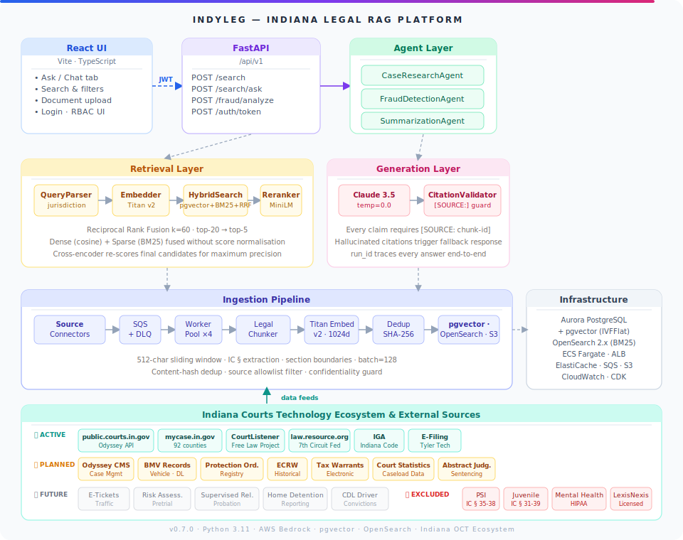
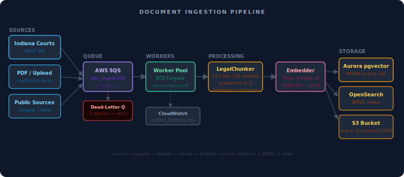
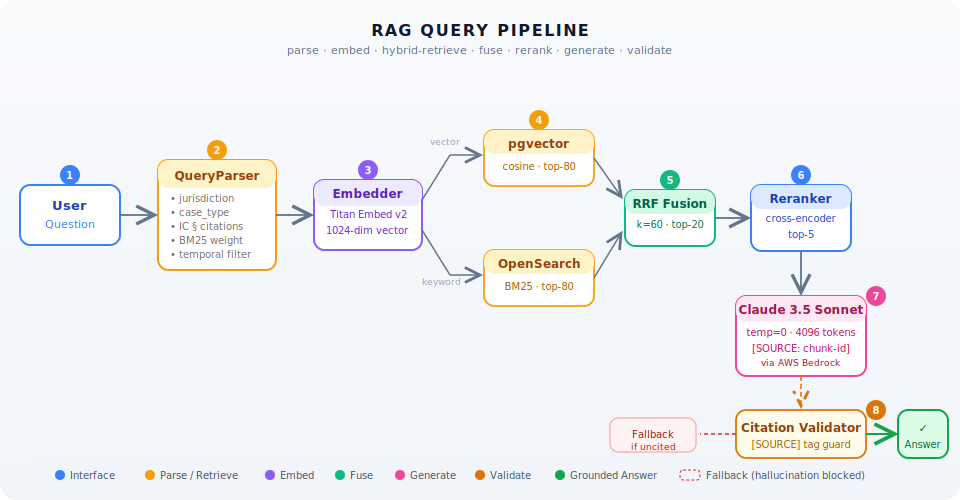
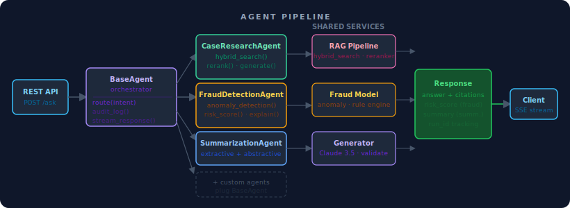
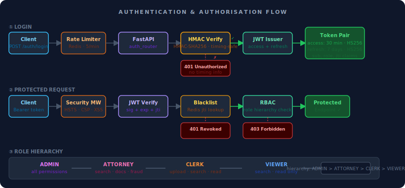

<p align="center">
  
</p>

<h1 align="center">IndyLeg — Indiana Legal RAG Platform</h1>

<p align="center">
  <em>AI-powered legal research and document intelligence for Indiana courts.</em><br/>
  Citation-grounded answers from case law, statutes, and court filings — in seconds.
</p>

<p align="center">
  <a href="https://www.python.org/downloads/"></a>
  <a href="https://www.typescriptlang.org/"></a>
  <a href="https://fastapi.tiangolo.com/"></a>
  <a href="https://aws.amazon.com/bedrock/"></a>
  <a href="LICENSE"></a>
  <a href="https://github.com/Anteneh-T-Tessema/legalairag/actions"></a>
</p>

<p align="center">
  <strong>📚 <a href="docs/">Documentation</a></strong> &nbsp;·&nbsp;
  <strong>🔍 <a href="#7-api-reference">API Reference</a></strong> &nbsp;·&nbsp;
  <strong>🚀 <a href="#10-local-development">Quick Start</a></strong> &nbsp;·&nbsp;
  <strong>🤝 <a href="docs/CONTRIBUTING.md">Contributing</a></strong>
</p>

---

## Features

- [x] **Hybrid retrieval** — pgvector cosine + BM25 fused via RRF for maximum recall. [Docs](docs/ARCHITECTURE.md#hybrid-retrieval)
- [x] **Citation-grounded answers** — every claim is anchored to a retrieved source; hallucinations are blocked. [Docs](docs/ARCHITECTURE.md#citation-validator)
- [x] **Indiana-specific parsing** — understands `IC §` citations, county jurisdictions, case-type taxonomy. [Docs](docs/ARCHITECTURE.md#query-parser)
- [x] **Fraud detection agent** — 5 anomaly detectors with risk scoring and investigation memos. [Docs](docs/FRAUD_DETECTION.md)
- [x] **Role-based access** — Admin / Attorney / Clerk / Viewer with JWT + Redis token blacklist. [Docs](docs/SECURITY.md)
- [x] **Production infrastructure** — ECS Fargate, Aurora pgvector, OpenSearch, SQS+DLQ, CloudWatch, ALB. [Docs](docs/DEPLOYMENT.md)
- [x] **712 tests · 100% coverage** — unit, integration, and end-to-end; all passing in CI. [Docs](docs/TESTING.md)
- [x] **Evaluation framework** — Recall@K, MRR, NDCG, faithfulness, and citation accuracy metrics. [Docs](docs/SYSTEM_ANALYSIS.md)

> [!TIP]
> **Quick start (< 5 minutes):**
> ```bash
> git clone https://github.com/Anteneh-T-Tessema/legalairag.git && cd legalairag
> python3.11 -m venv .venv && source .venv/bin/activate && pip install -e ".[dev]"
> cp .env.example .env          # fill in AWS credentials + secrets
> docker compose up -d          # postgres + opensearch + localstack
> uvicorn api.main:app --reload --port 8000   # API at http://localhost:8000/docs
> cd ui && npm install && npm run dev         # UI  at http://localhost:3000
> ```

---

## Table of Contents

1. [Why IndyLeg?](#1-why-indyleg)
2. [What Is RAG?](#2-what-is-rag)
3. [System Architecture](#3-system-architecture)
4. [Subsystem Deep Dives](#4-subsystem-deep-dives)
   - [Ingestion Pipeline](#41-ingestion-pipeline)
   - [Query Processing](#42-query-processing)
   - [Hybrid Retrieval](#43-hybrid-retrieval)
   - [Re-ranking](#44-re-ranking)
   - [Answer Generation](#45-answer-generation)
   - [Agent Orchestration](#46-agent-orchestration)
   - [Fraud Detection Agent](#47-fraud-detection-agent)
   - [Authority Ranker & Citation Graph](#48-authority-ranker--citation-graph)
   - [Public Legal Data Sources](#49-public-legal-data-sources)
   - [Evaluation Framework](#410-evaluation-framework)
5. [Authentication & Security](#5-authentication--security)
6. [Database Schema](#6-database-schema)
7. [API Reference](#7-api-reference)
8. [Configuration Reference](#8-configuration-reference)
9. [Project Structure](#9-project-structure)
10. [Local Development](#10-local-development)
11. [Running Tests](#11-running-tests)
12. [Ingestion CLI](#12-ingestion-cli)
13. [AWS Deployment](#13-aws-deployment)
14. [Performance](#14-performance)
15. [Design Decisions](#15-design-decisions)
16. [Troubleshooting](#16-troubleshooting)
17. [Contributing](#17-contributing)
18. [License](#18-license)
19. [Changelog](#19-changelog)

---

## 1. Why IndyLeg?

Legal research is time-consuming, error-prone, and expensive. An attorney searching for precedent on an eviction case in Marion County must manually:

- Search multiple court portals (Odyssey, Tyler, PACER)
- Read dozens of case documents
- Cross-reference Indiana Code statutes
- Verify citations before relying on them

IndyLeg automates this entire workflow. It continuously ingests documents from the Indiana courts system, indexes them with both semantic and keyword search, and allows staff to ask plain-English questions and receive **cite-grounded answers** — every claim backed by a document chunk with a verifiable source reference.

**Key properties:**

| Property | Detail |
|---|---|
| **Citation-grounded** | Every generated sentence is anchored to a retrieved source; hallucinations are detected and blocked |
| **Role-aware access** | Admin / Attorney / Clerk / Viewer roles with JWT |
| **Hybrid retrieval** | Dense (pgvector) + Sparse (BM25) fused via Reciprocal Rank Fusion |
| **Indiana-specific** | Understands `IC §` citation patterns, county jurisdictions, case type taxonomy |
| **Production-ready** | SQS dead-letter queues, ECS auto-scaling, CloudWatch audit logs, GitHub Actions CI |

---

## 2. What Is RAG?

**Retrieval-Augmented Generation (RAG)** is an architecture pattern that separates *what the AI knows* from *what it can look up*. Rather than relying solely on knowledge baked into a large language model's weights (which can be stale or hallucinated), a RAG system:

1. **Retrieves** relevant passages from an up-to-date document store
2. **Augments** the LLM's prompt with those passages as verified context
3. **Generates** an answer grounded in that context

```text
  WITHOUT RAG                          WITH RAG
  ───────────                          ────────
  User Question                        User Question
       │                                    │
       ▼                                    ▼
  LLM (frozen weights)            ┌── Retriever ──┐
       │                          │  (pgvector +  │
       ▼                          │   BM25 + RRF) │
  Answer ← may hallucinate        └───────┬───────┘
                                          │ retrieved passages
                                          ▼
                                    LLM (with context)
                                          │
                                          ▼
                                    Grounded Answer
                                    + [SOURCE: doc-id]
```

### Why RAG Fits Legal Research

Legal answers must be **verifiable**. A lawyer cannot cite "the AI said so" — they need the docket entry, statute section, or case holding. RAG produces traceable answers where every factual claim maps back to a document chunk that was actually retrieved. The IndyLeg citation validator enforces this: any claim in the response that cannot be matched to a retrieved chunk triggers a fallback response rather than a plausible-sounding hallucination.

---

## 3. System Architecture

### High-Level Overview

<p align="center">
  
</p>

<details>
<summary><strong>ASCII architecture diagram (click to expand)</strong></summary>

```text
┌─────────────────────────────────────────────────────────────────────────────────┐
│                         INDYLEG — INDIANA LEGAL RAG PLATFORM                    │
│                                                                                 │
│  ╔═══════════════╗    ╔════════════════════╗    ╔══════════════════════════╗    │
│  ║  React UI     ║    ║   FastAPI           ║    ║  Agent Layer             ║    │
│  ║  (Vite + TS)  ║◄──►║   /api/v1           ║◄──►║                          ║    │
│  ║               ║    ║                    ║    ║  ┌──────────────────────┐ ║    │
│  ║  • Ask tab    ║    ║  • /search         ║    ║  │ CaseResearchAgent    │ ║    │
│  ║  • Search tab ║    ║  • /search/ask     ║    ║  │ (6-step RAG pipeline)│ ║    │
│  ║  • Chat tab   ║    ║  • /auth/token     ║    ║  ├──────────────────────┤ ║    │
│  ║  • Documents  ║    ║  • /health         ║    ║  │ SummarizationAgent   │ ║    │
│  ╚═══════════════╝    ╚═════════╦══════════╝    ║  │ (parties, holdings,  │ ║    │
│         ▲                       ║               ║  │  citations, deadlines│ ║    │
│         │ JWT Bearer            ║               ║  └──────────────────────┘ ║    │
│         │                       ▼               ║  Audit-logged, run_id     ║    │
│  ╔══════╩══════════════════════════════════╗    ╚══════════════════════════╝    │
│  ║              RETRIEVAL LAYER            ║                                    │
│  ║                                         ║                                    │
│  ║  QueryParser ──▶ Embedder ──▶ HybridSearch ──▶ CrossEncoder                 │
│  ║  ┌──────────┐   ┌────────┐   ┌──────────────┐ ┌──────────────────────┐     │
│  ║  │jurisdiction│  │Bedrock │   │ pgvector     │ │ ms-marco-MiniLM-L-6  │     │
│  ║  │county     │  │Titan v2│   │ cosine sim   │ │ (query, chunk) pairs │     │
│  ║  │case type  │  │1024-dim│   ├──────────────┤ │ sorted by score      │     │
│  ║  │IC §       │  │vectors │   │ OpenSearch   │ └──────────────────────┘     │
│  ║  │ citations │  └────────┘   │ BM25 keyword │                              │
│  ║  └──────────┘                ├──────────────┤                              │
│  ║                              │ RRF fusion   │                              │
│  ║                              │  k = 60      │                              │
│  ║                              └──────────────┘                              │
│  ╚══════════════════════════════╦════════════════════════════════════════════╝ │
│                                 ║                                              │
│  ╔══════════════════════════════╩════════════════════════════════════════════╗ │
│  ║              GENERATION LAYER                                             ║ │
│  ║                                                                           ║ │
│  ║  SystemPrompt ──▶ Bedrock Claude 3.5 Sonnet ──▶ CitationValidator        ║ │
│  ║  (citation-        (temp=0.0, max_tokens=        ([SOURCE:id] exists?    ║ │
│  ║   enforced          4096, Converse API)            fallback if not)       ║ │
│  ║   instructions)                                                           ║ │
│  ╚═══════════════════════════════════════════════════════════════════════════╝ │
│                                                                                │
│  ╔═══════════════════════════════════════════════════════════════════════════╗ │
│  ║              INGESTION LAYER                                              ║ │
│  ║                                                                           ║ │
│  ║  IndianaCourts ──▶ SQS Queue ──▶ Worker Pool ──▶ Embedder ──▶ pgvector  ║ │
│  ║  API (Odyssey)     (+ DLQ,        (async,          Bedrock                ║ │
│  ║  + CLI             3 retries)      concurrency=4)   Titan v2)             ║ │
│  ║                    ║                                       ║               ║ │
│  ║                    ║                              BM25 ──▶ OpenSearch      ║ │
│  ║                    ▼                                       ║               ║ │
│  ║                   S3 (raw)                        S3 ──▶ (processed)      ║ │
│  ╚═══════════════════════════════════════════════════════════════════════════╝ │
│                                                                                │
│  ╔═══════════════════════════════════════════════════════════════════════════╗ │
│  ║  INFRASTRUCTURE (AWS CDK)                                                 ║ │
│  ║  S3 │ SQS+DLQ │ Aurora PostgreSQL + pgvector │ OpenSearch │ ECS Fargate  ║ │
│  ║  Bedrock (Claude 3.5 Sonnet + Titan Embed v2) │ CloudWatch │ ALB         ║ │
│  ╚═══════════════════════════════════════════════════════════════════════════╝ │
└────────────────────────────────────────────────────────────────────────────────┘
```

</details>

### Ingestion Data Flow

<p align="center">
  
</p>

<details>
<summary><strong>Detailed ingestion flow diagram (click to expand)</strong></summary>

```text
  Indiana Courts Portal
  (Odyssey / Tyler API)
          │
          │  CourtCase + CaseDocument
          ▼
  ┌─────────────────┐
  │  IndianaCourts  │  rate-limited, exponential backoff
  │  API Client     │  max 5 concurrent requests
  └────────┬────────┘
           │  IngestionMessage (source_id, doc_url, metadata)
           ▼
  ┌─────────────────┐
  │   SQS Queue     │  batch send (up to 10)
  │   (FIFO + DLQ)  │  visibility timeout: 5 min
  └────────┬────────┘  max retries before DLQ: 3
           │  long-poll (20s wait)
           ▼
  ┌─────────────────────────────────────────────────────┐
  │  Worker Pool (asyncio, concurrency=4)               │
  │                                                     │
  │  ┌──────────┐   ┌──────────┐   ┌────────────────┐  │
  │  │  Download │──▶│  Parse   │──▶│  LegalChunker  │  │
  │  │ S3 / HTTP │   │ PDF/DOCX │   │                │  │
  │  └──────────┘   │ HTML/TXT │   │  • detect §    │  │
  │                 └──────────┘   │  • sliding win │  │
  │                                │  • IC § extract│  │
  │                                └───────┬────────┘  │
  │                                        │  List[Chunk]
  │                                        ▼
  │                               ┌────────────────┐   │
  │                               │BedrockEmbedder │   │
  │                               │                │   │
  │                               │ batch=128      │   │
  │                               │ Titan Embed v2 │   │
  │                               │ 1024-dim vecs  │   │
  │                               └───────┬────────┘   │
  └───────────────────────────────────────┼────────────┘
                                          │
                          ┌───────────────┼────────────────┐
                          ▼               ▼                ▼
                    pgvector         OpenSearch           S3
                 (cosine vectors)  (BM25 index)     (processed chunks
                  legal_chunks       indyleg-           as JSON)
                    table            legal-docs
```

</details>

### Query / Answer Data Flow

<p align="center">
  
</p>

<details>
<summary><strong>Detailed query/answer flow diagram (click to expand)</strong></summary>

```text
  User: "What is Indiana's eviction notice requirement?"
          │
          ▼
  ┌────────────────────────────────────────────────────┐
  │  QueryParser                                       │
  │  • jurisdiction → "Marion County"                  │
  │  • case_type    → CaseType.CIVIL                   │
  │  • citations    → ["IC 32-31-1-6"]                 │
  │  • bm25_keywords → ["eviction", "notice", "tenant"]│
  └──────────┬─────────────────────────────────────────┘
             │
             ▼
  ┌────────────────────┐
  │  BedrockEmbedder   │  → 1024-dim query vector
  │  Titan Embed v2    │
  └──────────┬─────────┘
             │
             ▼
  ┌─────────────────────────────────────────────────────┐
  │  HybridSearch                                       │
  │                                                     │
  │  ┌─────────────────┐    ┌──────────────────────┐   │
  │  │  pgvector       │    │  OpenSearch (BM25)   │   │
  │  │  cosine sim     │    │  keyword match       │   │
  │  │  top 80 results │    │  top 80 results      │   │
  │  └────────┬────────┘    └──────────┬───────────┘   │
  │           │                        │               │
  │           └──────────┬─────────────┘               │
  │                      ▼                             │
  │           ┌──────────────────┐                     │
  │           │  RRF Fusion      │  score = Σ 1/(k+r)  │
  │           │  k = 60          │  k = 60              │
  │           │  top 20 merged   │                     │
  │           └──────────────────┘                     │
  └──────────────────────┬──────────────────────────────┘
                         │
                         ▼
  ┌─────────────────────────────────────────────────────┐
  │  CrossEncoder (ms-marco-MiniLM-L-6-v2)              │
  │  Scores each (query, chunk) pair independently      │
  │  Returns top 5 by cross-attention score             │
  └──────────────────────┬──────────────────────────────┘
                         │  5 high-precision chunks
                         ▼
  ┌─────────────────────────────────────────────────────┐
  │  Bedrock Claude 3.5 Sonnet                          │
  │  System prompt: cite every claim with [SOURCE: id]  │
  │  User prompt: question + 5 numbered context chunks  │
  │  Temperature: 0.0 (deterministic, no creativity)    │
  │  Max tokens: 4096                                   │
  └──────────────────────┬──────────────────────────────┘
                         │
                         ▼
  ┌─────────────────────────────────────────────────────┐
  │  CitationValidator                                  │
  │  • Extract all [SOURCE: x] from response            │
  │  • Verify each x exists in retrieved chunks         │
  │  • Flag sentences with no source anchor             │
  │  • Fail-safe: return structured fallback if invalid │
  └──────────────────────┬──────────────────────────────┘
                         │
                         ▼
              Grounded Answer + source metadata
              confidence score + run_id for audit
```

</details>

---

## 4. Subsystem Deep Dives

### 4.1 Ingestion Pipeline

The ingestion pipeline turns raw court documents into searchable knowledge. It is designed to handle the irregular, citation-heavy structure of legal text.

#### Legal-Aware Document Chunking

Generic text splitters break documents at arbitrary character boundaries, severing citations and section headings from their context. The `LegalChunker` solves this by:

**Section boundary detection** — The chunker scans for structural headings using patterns like:
- `SECTION \d+`, `ARTICLE [IVX]+`, `§ \d+`
- Roman numeral headings (`I.`, `II.`, `III.`)
- Capitalised headings typical in court orders

When a boundary is detected, the current chunk is closed and a new one begins, preserving each section as a semantic unit.

**Indiana Code citation extraction** — Every chunk is scanned for `IC \d+-\d+-\d+-\d+` patterns (e.g., `IC 32-31-1-6`). Extracted citations are stored in the chunk's metadata, enabling citation-based filtering at query time.

**Sliding window with sentence awareness** — For long sections, the chunker applies a sliding window:
- Window size: **512 characters**
- Overlap: **64 characters**
- Split points prefer sentence boundaries (`.`, `?`, `!`) rather than arbitrary positions, keeping individual sentences intact

**Metadata enrichment** — Each chunk carries:

```json
{
  "chunk_id": "doc-abc123-chunk-007",
  "source_id": "case-49D01-2023-MF-001234",
  "source_type": "court_filing",
  "document_url": "s3://indyleg-raw-documents/...",
  "section_heading": "FINDINGS OF FACT",
  "page_number": 3,
  "citations": ["IC 32-31-1-6", "IC 32-31-3-9"],
  "jurisdiction": "Marion County",
  "case_type": "civil",
  "char_start": 1024,
  "char_end": 1536
}
```

#### Bedrock Embedder

The `BedrockEmbedder` converts text chunks into 1024-dimensional dense vectors using **Amazon Titan Embed Text v2** (`amazon.titan-embed-text-v2:0`). Key design choices:

- **Batch processing** — Chunks are embedded in batches of 128, reducing API round-trips by ~128×
- **Concurrency limiting** — An `asyncio.Semaphore` caps in-flight Bedrock calls to prevent rate limit errors
- **Thread executor wrapping** — The boto3 `invoke_model` call is a synchronous blocking I/O call; it is wrapped in `asyncio.get_event_loop().run_in_executor()` so the async worker can process multiple batches concurrently
- **Separate query embedding** — A dedicated `embed_query()` method handles single-query embedding at query time, reusing the same model configuration

#### SQS-Driven Worker

The worker pool decouples document discovery from embedding compute. This means:

- The Indiana Courts API client can discover and enqueue thousands of documents immediately
- Workers pull from the queue at their own pace, limited by `INGESTION_WORKER_CONCURRENCY=4`
- If a document fails processing (corrupt PDF, network timeout, Bedrock throttle), it is retried up to **3 times** before routing to the **Dead-Letter Queue (DLQ)** for manual inspection
- The visibility timeout is **5 minutes** for the ingestion queue and **10 minutes** for the embedding queue, accommodating slow document downloads and large batch embedding calls

#### Indiana Courts Source Client

The `IndianaCourtsCasesClient` wraps the Indiana Odyssey/Tyler court portal API:

```text
Methods:
  search_cases(query, county, case_type, date_from, date_to)
  get_case(case_number)
  download_document(document_id) → bytes
  list_recent_filings(county, days_back)

Safety features:
  • Rate limiting with exponential backoff
  • asyncio.Semaphore(5) — max 5 concurrent calls
  • Case number sanitization to strip injection characters
  • CaseDocument dataclass with typed fields
```

---

### 4.2 Query Processing

Before any search occurs, the `QueryParser` decomposes the user's raw question into structured components:

```text
Input:  "What are the notice requirements for evicting a tenant in Marion County?"

Output:
  normalized_query: "notice requirements evicting tenant Marion County"
  jurisdiction:     "Marion County"
  case_type:        CaseType.CIVIL
  citations:        []           ← none found in this query
  bm25_keywords:    ["notice", "requirements", "evicting", "tenant"]
                    (stopwords like "what", "are", "the", "a", "in" removed)
```

This structured output enables **metadata pre-filtering** in pgvector (`WHERE metadata->>'jurisdiction' = 'Marion County'`) before the vector similarity search, dramatically reducing the candidate set and improving precision.

---

### 4.3 Hybrid Retrieval

No single retrieval method is best for all queries. IndyLeg fuses two complementary approaches:

#### Dense Retrieval (pgvector)

Dense retrieval uses the same Titan Embed v2 model to embed the query and then performs a **cosine similarity search** over the 1024-dimensional vector space. It excels at:
- Semantic similarity ("tenant removal procedure" matches "eviction process")
- Paraphrase matching
- Implicit concept queries with no exact keyword overlap

#### Sparse Retrieval (BM25 / OpenSearch)

BM25 is a classical probabilistic keyword ranking algorithm. Given a query term, it scores documents by term frequency (how often the word appears) divided by document length. It excels at:
- Exact statutory citation matching (`IC 32-31-1-6`)
- Proper noun matching (case names, judge names)
- Rare or technical terms the embedding model may handle poorly

#### Reciprocal Rank Fusion (RRF)

RRF is the fusion algorithm that merges the two ranked lists. For each document appearing in either list, its score is:

$$\text{score}(d) = \sum_{i \in \{vector, bm25\}} \frac{1}{k + r_i(d)}$$

where $r_i(d)$ is the rank of document $d$ in list $i$, and $k = 60$ is a smoothing constant that prevents very high ranks from dominating.

**Why RRF over score normalization?** RRF is rank-based, so it does not require the two retrieval systems to produce comparable relevance scores (cosine similarity from pgvector is in [-1,1]; BM25 scores are unbounded positive numbers). RRF correctly handles cases where a document ranks #1 in BM25 but is absent from the vector results — it still gets credit.

Both the vector and BM25 search over-fetch by 4× (`top_k × 4`) to give the re-ranker a richer candidate pool after fusion.

---

### 4.4 Re-ranking

The cross-encoder re-ranker (`sentence-transformers/ms-marco-MiniLM-L-6-v2`) provides a precision boost beyond what bi-encoder retrieval can achieve.

**Bi-encoder vs. Cross-encoder:**

```text
Bi-encoder (retrieval):          Cross-encoder (re-ranking):
  Embed query once                  Score (query, doc) together
  Embed docs once (offline)         Model sees BOTH at once
  Dot product similarity            Full cross-attention
  Fast — O(1) per query             Slow — O(n) per query
  Good recall                       Better precision
```

The system uses bi-encoders (Titan Embed) at retrieval time to efficiently filter millions of chunks down to ~20, then applies the cross-encoder to re-score those 20 with full attention, returning the final top 5. This two-stage pipeline gets the best of both: the speed of embedding-based retrieval and the precision of cross-attention scoring.

The cross-encoder runs in a **thread executor** (same pattern as the embedder) to avoid blocking the async event loop during the CPU-bound model inference.

---

### 4.5 Answer Generation

#### Bedrock Converse API

The `BedrockClient` wraps the [Bedrock Converse API](https://docs.aws.amazon.com/bedrock/latest/userguide/conversation-inference.html) with two methods:

| Method | Use case | Behaviour |
|---|---|---|
| `complete(prompt, system)` | Research agent, summarization | Returns full response string |
| `complete_stream(prompt, system)` | Future streaming UI | Async generator of text chunks |

Configuration:
- **Model**: `anthropic.claude-3-5-sonnet-20241022-v2:0`
- **Temperature**: `0.0` — fully deterministic; no creative variation
- **Max tokens**: `4096` — sufficient for multi-paragraph legal answers with full citations
- **System prompt**: Injects citation enforcement instructions before the user turn

#### Citation Validator (Hallucination Guard)

After generation, every response passes through the `CitationValidator`:

```text
Response text:
  "Indiana law requires 10 days notice before eviction [SOURCE: chunk-003].
   The landlord must also file in small claims court [SOURCE: chunk-007]."

Validation steps:
  1. Extract all [SOURCE: x] markers → ["chunk-003", "chunk-007"]
  2. Check each against retrieved_chunk_ids → both found ✓
  3. Scan sentences without any [SOURCE: ...] marker → none found ✓
  4. Result: ValidationResult(passed=True, warnings=[])

Failure case:
  "The penalty is $5,000 per violation."  ← no citation
  Result: ValidationResult(passed=False, warnings=["Uncited assertion detected"])
  Action: Return structured fallback response instead of potentially false claim
```

---

### 4.6 Agent Orchestration

<p align="center">
  
</p>

#### CaseResearchAgent (6-Step Pipeline)

The research agent coordinates the full RAG pipeline:

```text
Step 1 — Parse Query
  Input:  raw user question (string)
  Output: ParsedQuery(jurisdiction, case_type, citations, bm25_keywords)
  Audit:  LOG step=parse, query_len, extracted_fields

Step 2 — Embed Query
  Input:  normalized query string
  Output: 1024-dim float vector
  Audit:  LOG step=embed, model=titan-embed-v2

Step 3 — Hybrid Search
  Input:  vector, bm25_keywords, metadata filters
  Output: ~20 candidates (RRF-fused from pgvector + BM25)
  Audit:  LOG step=search, vector_hits, bm25_hits, fused_count

Step 4 — Re-rank
  Input:  query + ~20 candidates
  Output: top 5 chunks (cross-encoder scored)
  Audit:  LOG step=rerank, top_score, score_distribution

Step 5 — Generate + Validate
  Input:  query, top 5 chunks, system prompt
  Output: validated response with confidence score
  Audit:  LOG step=generate, run_id, validation_passed, token_count
```

Each run is assigned a **`run_id`** (UUID) that threads through all five audit log entries. This enables full end-to-end tracing: when a user reports a bad answer, the `run_id` in the response lets an admin replay the exact query, see which chunks were retrieved, and determine whether the problem was retrieval or generation.

**Confidence estimation** — Computed from the cross-encoder scores of the top-5 chunks:
- If the top chunk scores > 0.8: `HIGH` confidence
- Scores 0.5–0.8: `MEDIUM`
- Below 0.5: `LOW` (response includes a caveat)

#### SummarizationAgent

Summarizes individual case documents using a structured extraction prompt:

```json
{
  "parties": ["Plaintiff: Smith, John", "Defendant: Johnson, Mary"],
  "key_holdings": ["Court found for defendant on eviction claim"],
  "citations": ["IC 32-31-1-6", "IC 32-31-3-9"],
  "deadlines": ["Response due: 2024-03-15"],
  "summary": "..."
}
```

---

### 4.7 Fraud Detection Agent

The `FraudDetectionAgent` scans Indiana legal filings for patterns that suggest fraudulent activity — identity theft in court records, serial deed fraud, and suspicious filing patterns. It is strictly a detection and flagging system: no automated enforcement actions are taken.

#### Architecture

The agent extends `BaseAgent` and follows a 6-step pipeline:

```text
Step 1 — Parse + Embed Query
  Input:  "quitclaim deed Marion County last 90 days"
  Output: ParsedQuery + 1024-dim query vector

Step 2 — Retrieve Filings (wide net)
  top_k = 50 (intentionally wider than normal 5-10 for pattern analysis)

Step 3 — Pattern Analysis (_FilingPatternAnalyzer)
  Run all 5 detectors in sequence over the retrieved set

Step 4 — Risk Scoring
  Aggregate indicator severities → overall risk level

Step 5 — Investigation Summary
  LLM-generated memo (Bedrock Claude) describing findings

Step 6 — Persist Audit Trail
  AgentRun record with run_id → all indicators + evidence
```

#### Five Pattern Detectors

| Detector | What It Flags | Threshold | Severity |
|---|---|---|---|
| **Burst Filing** | Same party files >5 cases within 30 days | ≥6 filings/30-day window | Medium (6-9) / High (10+) |
| **Identity Reuse** | Same SSN fragment, DOB, or address across unrelated cases | SSN in >2 cases, DOB in >3 cases | High (SSN) / Medium (DOB) |
| **Deed Fraud** | Quitclaim deeds with nominal consideration ($1-$100) | ≥3 matching cases | High |
| **Suspicious Entities** | Numerically-named entities (e.g. "Entity 42 LLC") | ≥2 cases | Medium |
| **Rapid Ownership Transfer** | Property changes hands 3+ times within 90 days | ≥3 transfers in 90 days | High |

#### Fraud Indicator Structure

Each detected anomaly is captured as a `FraudIndicator`:

```python
FraudIndicator(
    indicator_type="burst_filing",
    severity="high",           # "low" | "medium" | "high" | "critical"
    description="Party 'john doe' filed 12 cases in 30 days...",
    evidence=["case-001", "case-002", ...],  # source IDs
    confidence=0.85,           # 0.0–1.0
    metadata={"party": "john doe", "window_start": "2024-01-15"},
)
```

#### Risk Scoring

The overall risk level is computed from individual indicator severities:
- **Critical**: any indicator with `severity="critical"` or ≥3 high-severity indicators
- **High**: any high-severity indicator
- **Medium**: any medium-severity indicator
- **Low**: only low-severity indicators
- **None**: no indicators detected

Results with `risk_level ∈ {medium, high, critical}` automatically set `requires_human_review=True`.

#### API Endpoint

```text
POST /api/v1/fraud/analyze
Authorization: Bearer <token>

Request:  { "query": "quitclaim deed Marion County" }
Response: {
  "run_id": "a1b2c3d4-...",
  "risk_level": "high",
  "requires_human_review": true,
  "total_filings_analyzed": 47,
  "indicators": [ ... ],
  "flagged_source_ids": ["case-001", "case-005"],
  "summary": "Investigation found 3 quitclaim deeds..."
}
```

---

### 4.8 Authority Ranker & Citation Graph

#### AuthorityRanker

The `AuthorityRanker` re-scores retrieval results by blending the retrieval score with the authoritativeness of the issuing court under Indiana law. A lower retrieval score from the Indiana Supreme Court should often outrank a higher score from a trial court for binding precedent questions.

**Indiana Court Hierarchy Weights:**

| Court | Weight | Rationale |
|---|---|---|
| US Supreme Court | 1.00 | Binding on federal constitutional questions |
| 7th Circuit Court of Appeals | 0.90 | Binding federal circuit for Indiana |
| Indiana Supreme Court | 0.85 | Highest Indiana state authority |
| Indiana Court of Appeals | 0.70 | Binding unless overruled by Ind. Supreme Court |
| Indiana Tax Court | 0.60 | Specialized — tax matters only |
| Federal District Courts (S.D./N.D. Ind.) | 0.55 | Persuasive on state questions |
| Indiana Trial/Circuit Courts | 0.40 | Persuasive only |

**Blending Formula:**

$$\text{final\_score} = (1 - \alpha) \times \text{retrieval\_score} + \alpha \times \text{authority\_score}$$

Default $\alpha = 0.30$ — authority contributes 30% of the final score. Configurable per query type (citation-lookup queries use lower alpha).

#### Temporal Validity Filtering

Results can be filtered for temporal validity:
- **Statutes**: must have `effective_date ≤ reference_date` and no expired `expiry_date`
- **Case law**: generally valid unless overruled (see citation graph below)

Stale documents are filtered with a warning log so administrators can investigate.

#### CitationGraph

The `CitationGraph` builds an in-memory directed graph of legal citation relationships:

```text
Nodes:  legal opinions / statutes (identified by source_id)
Edges:  citation relationships with treatment labels (citing → cited)
```

**Capabilities:**

| Feature | Description |
|---|---|
| **Good-law check** | Detects overruled/reversed opinions via negative treatment edges |
| **PageRank authority** | Iterative authority propagation (damping=0.85, 30 iterations); widely-cited opinions get higher scores |
| **Precedent chains** | BFS traversal to depth N — find all precedents for a given opinion |
| **Result enrichment** | Filters bad-law results and boosts highly-cited opinions with a configurable `pagerank_alpha` |

**Treatment Classification:**

- **Negative** (marks opinion as not good law): `overruled`, `reversed`, `disapproved`, `abrogated`, `criticized`, `distinguished`
- **Positive** (passes authority in PageRank): `affirmed`, `followed`, `cited`, `relied on`, `approved`

---

### 4.9 Public Legal Data Sources

IndyLeg can ingest from three public legal data sources in addition to the Indiana courts portal:

#### CourtListener Client

Async client for the [CourtListener REST API v4](https://www.courtlistener.com/api/rest-info/) (Free Law Project):

| Feature | Detail |
|---|---|
| **Courts** | Indiana Supreme Court, Court of Appeals, Tax Court, 7th Circuit |
| **Pagination** | Auto-paginated with configurable `max_pages` safety cap |
| **Rate limiting** | Exponential backoff on HTTP 429; configurable concurrency semaphore (default 3) |
| **Authentication** | Optional API token for higher rate limits |
| **Output** | `PublicLegalOpinion` dataclass with normalized metadata |

```python
async with CourtListenerClient() as cl:
    opinions = await cl.fetch_indiana_opinions(
        date_from=date(2024, 1, 1),
        include_federal=True,
    )
```

#### Law.Resource.Org Client

Downloads Federal Reporter HTML opinions from [law.resource.org](https://law.resource.org/pub/us/case/reporter/):

- Targets 7th Circuit opinions (F.2d, F.3d series)
- Filters for Indiana relevance by scanning for Indiana-specific terms
- Parses Apache-style directory listings for volume/file discovery
- All content is public domain government documents

#### IndianaCodeClient

Fetches Indiana Code sections directly from the [Indiana General Assembly API](https://iga.in.gov):

```python
async with IndianaCodeClient() as iga:
    # Fetch all sections under Title 35 (Criminal Law)
    statutes = await iga.fetch_title(35)

    # Fetch a single section
    section = await iga.fetch_section(title=32, article=31, chapter=1, section=6)
```

Each statute is returned as an `IndianaStatute` dataclass with `full_citation`, `section_text`, `effective_date`, and a canonical URL.

---

### 4.10 Evaluation Framework

The `RAGEvaluator` provides offline evaluation of the full RAG pipeline using standard IR and generation quality metrics.

#### Retrieval Metrics

| Metric | Formula | What It Measures |
|---|---|---|
| **Recall@K** | $\frac{\lvert \text{retrieved}_K \cap \text{relevant} \rvert}{\lvert \text{relevant} \rvert}$ | Fraction of relevant docs found in top-K |
| **Precision@K** | $\frac{\lvert \text{retrieved}_K \cap \text{relevant} \rvert}{K}$ | Fraction of top-K that are relevant |
| **MRR** | $\frac{1}{\text{rank of first relevant doc}}$ | Position of first relevant result |
| **NDCG@K** | $\frac{DCG@K}{IDCG@K}$ | Graded relevance with position discounting |

#### Generation Metrics

| Metric | What It Measures |
|---|---|
| **Citation Accuracy** | Fraction of `[SOURCE: id]` references that map to actually-retrieved chunks |
| **Faithfulness** | Fraction of legal claims in the answer that are grounded in retrieved context |

#### Evaluation Dataset Format

```json
{
  "name": "Indiana Eviction Law Eval",
  "examples": [
    {
      "query_id": "eviction-001",
      "query": "What notice is required before eviction in Indiana?",
      "relevant_source_ids": ["ic-32-31-1-6-chunk-001", "case-49D01-chunk-003"],
      "graded_relevance": { "ic-32-31-1-6-chunk-001": 3, "case-49D01-chunk-003": 2 },
      "expected_citations": ["IC 32-31-1-6"],
      "jurisdiction": "Indiana"
    }
  ]
}
```

#### Running Evaluation

```python
from retrieval.evaluator import RAGEvaluator, EvalDataset

dataset = EvalDataset.from_json("tests/data/eval_queries.json")
evaluator = RAGEvaluator(embedder, searcher, reranker, generator)
report = await evaluator.evaluate(dataset, k_values=[1, 5, 10])
report.print_summary()
```

Output:
```text
============================================================
EVALUATION REPORT — Indiana Eviction Law Eval
============================================================
Examples evaluated : 15
MRR                : 0.8200
Recall@1           : 0.6000  Precision@1  : 0.6000  NDCG@1  : 0.5800
Recall@5           : 0.8500  Precision@5  : 0.3400  NDCG@5  : 0.7200
Recall@10          : 0.9200  Precision@10 : 0.1840  NDCG@10 : 0.7800
Citation Accuracy  : 0.9400
Faithfulness       : 0.8700
============================================================
```

---

## 5. Authentication & Security

<p align="center">
  
</p>

### JWT Token Architecture

```text
POST /api/v1/auth/token  (login with username + password)
        │
        ▼
┌────────────────────────────────────────┐
│  Verify HMAC-SHA256(password + salt)   │
│  (password stored as hex(sha256(salt   │
│   + password)), random 32-byte salt)   │
└──────────────┬─────────────────────────┘
               │  credentials valid
               ▼
┌──────────────────────────────────────┐
│  create_access_token()               │  exp: +60 minutes, HS256
│  create_refresh_token()              │  exp: +7 days, HS256
└──────────────┬───────────────────────┘
               │
               ▼
  { "access_token": "eyJ...",
    "refresh_token": "eyJ...",
    "token_type": "bearer" }


POST /api/v1/auth/refresh
  Body: { "refresh_token": "eyJ..." }
  → validates refresh token, issues new access_token


GET /api/v1/... (protected endpoints)
  Header: Authorization: Bearer <access_token>
  → get_current_user() FastAPI Depends() decodes and validates JWT
  → require_role(Role.ATTORNEY) decorator checks roles claim
```

### Role Model

| Role | Access |
|---|---|
| `ADMIN` | All endpoints + ingestion management |
| `ATTORNEY` | Search, RAG answers, document viewer |
| `CLERK` | Search, document upload |
| `VIEWER` | Read-only search |

### Password Security

Passwords are hashed using:

```python
salt = secrets.token_bytes(32)               # cryptographically random
digest = hmac.new(salt, password.encode(), hashlib.sha256).hexdigest()
stored = f"{salt.hex()}:{digest}"
```

No plaintext passwords are stored or logged. The `AuditLogMiddleware` automatically redacts `Authorization` headers from request logs.

### API Security Headers

The FastAPI CORS middleware is configured with an explicit `allow_origins` list (not `*`). Swagger UI (`/docs`) is disabled in production (`app_env=production`) to prevent API enumeration.

---

## 6. Database Schema

### `legal_chunks` Table (PostgreSQL + pgvector)

```sql
CREATE EXTENSION IF NOT EXISTS vector;

CREATE TABLE legal_chunks (
    chunk_id     TEXT PRIMARY KEY,
    source_id    TEXT NOT NULL,
    section      TEXT,
    section_idx  INTEGER,
    char_start   INTEGER,
    char_end     INTEGER,
    citations    TEXT[],
    metadata     JSONB,
    content      TEXT NOT NULL,
    embedding    vector(1024)
);

-- IVFFlat index for approximate nearest neighbor search
CREATE INDEX IF NOT EXISTS legal_chunks_embedding_idx
    ON legal_chunks USING ivfflat (embedding vector_cosine_ops)
    WITH (lists = 100);

-- B-tree index on source_id for filtered queries
CREATE INDEX IF NOT EXISTS legal_chunks_source_idx ON legal_chunks (source_id);
```

**Why IVFFlat?** IVFFlat (Inverted File with Flat quantization) partitions the vector space into clusters and searches only the nearest clusters at query time. It is simple to tune (`lists` parameter) and works well for legal corpora that grow incrementally.

### `document_versions` Table

```sql
CREATE TABLE document_versions (
    id              UUID PRIMARY KEY DEFAULT gen_random_uuid(),
    source_id       TEXT NOT NULL,
    content_hash    TEXT NOT NULL,         -- SHA-256 of document text (dedup key)
    version         INTEGER NOT NULL DEFAULT 1,
    ingested_at     TIMESTAMPTZ DEFAULT NOW(),
    metadata        JSONB NOT NULL,
    UNIQUE(source_id, content_hash)       -- prevents duplicate ingestion
);
```

The ingestion worker calls `record_version()` before processing a document. If the `(source_id, content_hash)` pair already exists, the document is skipped — preventing duplicate embeddings when the same document is re-discovered via multiple ingestion paths.

### `citation_edges` Table

```sql
CREATE TABLE citation_edges (
    id              UUID PRIMARY KEY DEFAULT gen_random_uuid(),
    citing_id       TEXT NOT NULL,
    cited_id        TEXT NOT NULL,
    treatment       TEXT NOT NULL,         -- 'cited', 'followed', 'overruled', etc.
    is_negative     BOOLEAN DEFAULT FALSE,
    date_cited      DATE,
    context_snippet TEXT,
    created_at      TIMESTAMPTZ DEFAULT NOW()
);

CREATE INDEX ON citation_edges (citing_id);
CREATE INDEX ON citation_edges (cited_id);
CREATE INDEX ON citation_edges (treatment);
```

This table persists the `CitationGraph` edges for production use. The in-memory graph is loaded from this table on startup and updated as new opinions are ingested.

### OpenSearch Index (`indyleg-legal-docs`)

```json
{
  "settings": {
    "analysis": {
      "analyzer": {
        "legal_analyzer": {
          "type": "custom",
          "tokenizer": "standard",
          "filter": ["lowercase", "stop"]
        }
      }
    }
  },
  "mappings": {
    "properties": {
      "chunk_id":    { "type": "keyword" },
      "text":        { "type": "text", "analyzer": "legal_analyzer" },
      "source_id":   { "type": "keyword" },
      "jurisdiction":{ "type": "keyword" },
      "case_type":   { "type": "keyword" },
      "citations":   { "type": "keyword" }
    }
  }
}
```

---

## 7. API Reference

**Base URL:** `https://your-alb-dns/api/v1`  
All endpoints except `/auth/token` and `/health` require `Authorization: Bearer <token>`.

**Rate limiting:** Every endpoint is protected by a Redis sliding-window rate limiter. Exceeded limits return `HTTP 429` with the headers below.

| Header | Description |
|---|---|
| `X-RateLimit-Limit` | Maximum requests allowed in the current window |
| `X-RateLimit-Remaining` | Requests remaining in the current window |
| `X-RateLimit-Reset` | Unix timestamp when the window resets |
| `Retry-After` | Seconds until the client may retry (on 429 only) |

---

### Authentication

#### `POST /auth/token` — Login

**Request:**
```json
{
  "username": "attorney1",
  "password": "s3cur3p@ss"
}
```

**Response `200 OK`:**
```json
{
  "access_token": "eyJhbGciOiJIUzI1NiIsInR5cCI6IkpXVCJ9...",
  "refresh_token": "eyJhbGciOiJIUzI1NiIsInR5cCI6IkpXVCJ9...",
  "token_type": "bearer",
  "expires_in": 3600
}
```

**Response `401 Unauthorized`:**
```json
{ "detail": "Invalid credentials" }
```

---

#### `POST /auth/refresh` — Refresh Access Token

**Request:**
```json
{ "refresh_token": "eyJ..." }
```

**Response `200 OK`:**
```json
{ "access_token": "eyJ...", "token_type": "bearer", "expires_in": 3600 }
```

---

#### `GET /auth/me` — Current User Profile

**Response `200 OK`:**
```json
{
  "user_id": "usr-001",
  "username": "attorney1",
  "roles": ["attorney"],
  "email": "attorney1@example.com"
}
```

---

### Search & RAG

#### `POST /search` — Hybrid Retrieval

Returns ranked document chunks without generating an answer. Useful for document exploration.

**Request:**
```json
{
  "query": "eviction notice requirements Marion County",
  "top_k": 10,
  "filters": {
    "jurisdiction": "Marion County",
    "case_type": "civil"
  }
}
```

**Response `200 OK`:**
```json
{
  "query": "eviction notice requirements Marion County",
  "results": [
    {
      "chunk_id": "case-49D01-2023-MF-001234-chunk-003",
      "text": "Indiana Code § 32-31-1-6 requires the landlord to provide...",
      "source_id": "case-49D01-2023-MF-001234",
      "source_type": "court_filing",
      "score": 0.923,
      "metadata": {
        "jurisdiction": "Marion County",
        "case_type": "civil",
        "citations": ["IC 32-31-1-6"],
        "section_heading": "FINDINGS OF FACT",
        "page_number": 3
      }
    }
  ],
  "total": 10,
  "search_time_ms": 145
}
```

---

#### `POST /search/ask` — RAG Answer Generation

Runs the full 6-step CaseResearchAgent pipeline: retrieval → re-ranking → generation → validation.

**Request:**
```json
{
  "question": "What is the required notice period before evicting a tenant in Indiana?",
  "filters": {
    "jurisdiction": "Marion County"
  },
  "stream": false
}
```

**Response `200 OK`:**
```json
{
  "answer": "Under Indiana law, a landlord must provide at least 10 days written notice before initiating eviction proceedings [SOURCE: chunk-003]. For non-payment of rent, this notice must specifically state the amount owed and the cure period [SOURCE: chunk-007].",
  "sources": [
    {
      "chunk_id": "chunk-003",
      "text": "IC 32-31-1-6 provides that...",
      "source_id": "case-49D01-2023-MF-001234",
      "score": 0.923
    },
    {
      "chunk_id": "chunk-007",
      "text": "The notice must include...",
      "source_id": "statute-ic-32-31-1",
      "score": 0.887
    }
  ],
  "confidence": "HIGH",
  "run_id": "a1b2c3d4-e5f6-7890-abcd-ef1234567890",
  "validation": {
    "passed": true,
    "warnings": []
  },
  "latency_ms": 1420
}
```

---

### Fraud Detection

#### `POST /fraud/analyze` — Fraud Pattern Analysis

Runs the `FraudDetectionAgent` over filings matching the query. Returns risk assessment and flagged indicators. All results are advisory only — no automated actions are taken.

**Request:**
```json
{
  "query": "quitclaim deed Marion County 2024"
}
```

**Response `200 OK`:**
```json
{
  "run_id": "d4e5f6a7-b8c9-0123-4567-89abcdef0123",
  "query_context": "quitclaim deed Marion County 2024",
  "risk_level": "high",
  "requires_human_review": true,
  "total_filings_analyzed": 47,
  "flagged_source_ids": ["case-49D01-2024-PL-000123", "case-49D01-2024-PL-000456"],
  "summary": "Investigation found 3 quitclaim deeds with nominal consideration ($1-$100)...",
  "indicators": [
    {
      "indicator_type": "deed_fraud_pattern",
      "severity": "high",
      "description": "Found 3 quitclaim deeds with nominal consideration ($1-$100).",
      "evidence": ["case-49D01-2024-PL-000123", "case-49D01-2024-PL-000456", "case-49D01-2024-PL-000789"],
      "confidence": 0.80
    }
  ]
}
```

---

### Health

#### `GET /health`

```json
{
  "status": "ok",
  "env": "development"
}
```

---

## 8. Configuration Reference

All configuration is via environment variables, loaded by Pydantic `BaseSettings` from `.env` or the environment. Secrets (API keys, DB passwords) must never be committed to version control.

> [!WARNING]
> Never commit `.env`, `AWS_ACCESS_KEY_ID`, `AWS_SECRET_ACCESS_KEY`, or `API_SECRET_KEY` to version control. Use AWS Secrets Manager or IAM roles in production.

| Variable | Default | Required | Description |
|---|---|---|---|
| `APP_ENV` | `development` | No | `development` \| `staging` \| `production` |
| `API_SECRET_KEY` | — | **Yes** | JWT signing key (≥ 32 random bytes) |
| `AWS_REGION` | `us-east-1` | No | AWS region for all services |
| `AWS_ACCESS_KEY_ID` | — | **Yes** | AWS credentials (use IAM role in ECS) |
| `AWS_SECRET_ACCESS_KEY` | — | **Yes** | AWS credentials |
| `BEDROCK_EMBEDDING_MODEL` | `amazon.titan-embed-text-v2:0` | No | Titan Embed model ID |
| `BEDROCK_LLM_MODEL` | `anthropic.claude-3-5-sonnet-20241022-v2:0` | No | Claude model ID |
| `BEDROCK_MAX_TOKENS` | `4096` | No | Max tokens for generation |
| `S3_BUCKET_RAW` | `indyleg-raw-documents` | No | S3 bucket for raw court documents |
| `S3_BUCKET_PROCESSED` | `indyleg-processed-chunks` | No | S3 bucket for processed chunks |
| `SQS_INGESTION_QUEUE_URL` | — | **Yes** | SQS URL for document ingestion |
| `SQS_EMBEDDING_QUEUE_URL` | — | **Yes** | SQS URL for embedding jobs |
| `DATABASE_URL` | — | **Yes** | PostgreSQL DSN (`postgresql+asyncpg://...`) |
| `VECTOR_DIMENSION` | `1024` | No | Embedding vector dimension |
| `OPENSEARCH_HOST` | `localhost` | No | OpenSearch cluster endpoint |
| `OPENSEARCH_PORT` | `9200` | No | OpenSearch port |
| `INDIANA_COURTS_API_BASE` | — | **Yes** | Indiana Odyssey/Tyler API base URL |
| `INDIANA_COURTS_API_KEY` | — | **Yes** | API key for courts portal |
| `EMBEDDING_BATCH_SIZE` | `128` | No | Chunks per Bedrock embedding call |
| `INGESTION_WORKER_CONCURRENCY` | `4` | No | Parallel SQS worker coroutines |
| `RERANK_TOP_K` | `20` | No | Candidates fed to cross-encoder |
| `RETRIEVAL_TOP_K` | `5` | No | Final chunks returned to LLM |
| `LOG_LEVEL` | `INFO` | No | Structured log level |
| `COURTLISTENER_API_TOKEN` | — | No | CourtListener API token (higher rate limits) |
| `AUTHORITY_ALPHA` | `0.30` | No | Authority score blending weight (0.0–1.0) |

Generate a secure `API_SECRET_KEY`:

```bash
python -c "import secrets; print(secrets.token_hex(32))"
```

---

## 9. Project Structure

<details>
<summary><strong>Full directory tree (click to expand)</strong></summary>

```text
indyleg/
├── .env.example                    # Template — copy to .env and fill in secrets
├── .github/
│   └── workflows/
│       └── ci.yml                  # GitHub Actions: backend tests, tsc+build, docker smoke
├── config/
│   ├── settings.py                 # Pydantic BaseSettings — single config source of truth
│   └── logging.py                  # structlog JSON logging setup
├── ingestion/
│   ├── __main__.py                 # python -m ingestion entry point
│   ├── cli.py                      # Click CLI: recent / search / case subcommands
│   ├── sources/
│   │   ├── indiana_courts.py       # Async Indiana Odyssey/Tyler portal client
│   │   ├── public_resource.py      # CourtListener, law.resource.org, IGA clients
│   │   └── document_loader.py      # PDF/DOCX/HTML/TXT → plain text
│   ├── pipeline/
│   │   ├── chunker.py              # Legal-aware sliding window chunker
│   │   ├── embedder.py             # Bedrock Titan Embed v2, batch + semaphore
│   │   └── worker.py               # SQS-driven async orchestrator + dedup
│   └── queue/
│       └── sqs.py                  # SQS producer/consumer, long-poll, batch
├── retrieval/
│   ├── hybrid_search.py            # pgvector + BM25 + RRF fusion
│   ├── reranker.py                 # Cross-encoder ms-marco-MiniLM-L-6-v2
│   ├── query_parser.py             # Jurisdiction / case_type / citation extraction
│   ├── authority.py                # AuthorityRanker (court hierarchy) + CitationGraph
│   ├── evaluator.py                # Offline evaluation: Recall, Precision, MRR, NDCG
│   └── indexer.py                  # Document versioning + citation edge persistence
├── generation/
│   ├── bedrock_client.py           # Bedrock Converse API wrapper
│   ├── generator.py                # Prompt assembly + generation orchestration
│   ├── validator.py                # Citation validator + hallucination guard
│   └── prompts/
│       └── legal_qa.py             # System prompts for legal Q&A generation
├── agents/
│   ├── base_agent.py               # BaseAgent ABC — audit trail, tool access control
│   ├── research_agent.py           # 6-step CaseResearchAgent + authority reranking
│   ├── summarization_agent.py      # Structured document summarization
│   └── fraud_detection_agent.py    # Fraud pattern detection (5 detectors + risk scoring)
├── api/
│   ├── auth.py                     # JWT creation, HMAC-SHA256 password hashing
│   ├── main.py                     # FastAPI app, CORS, AuditLogMiddleware
│   ├── middleware/
│   │   └── audit_log.py            # Request/response audit logging middleware
│   ├── schemas/
│   │   ├── documents.py            # Document upload/download schemas
│   │   ├── fraud.py                # FraudAnalysisRequest/Response schemas
│   │   └── search.py               # Search request/response schemas
│   └── routers/
│       ├── auth_router.py          # POST /auth/token  POST /auth/refresh  GET /auth/me
│       ├── search.py               # POST /search  POST /search/ask
│       ├── documents.py            # Document management endpoints
│       └── fraud.py                # POST /fraud/analyze
├── ui/                             # React + TypeScript + Vite frontend
│   ├── src/
│   │   ├── App.tsx                 # Tab navigation, auth gate, logout
│   │   ├── main.tsx                # React DOM entry point
│   │   ├── index.css               # Full responsive stylesheet (CSS variables)
│   │   ├── api/
│   │   │   └── client.ts           # Typed API client (fetch wrapper)
│   │   └── components/
│   │       ├── ChatInterface.tsx    # RAG chat interface
│   │       ├── SearchBar.tsx        # Search input with filters
│   │       ├── SearchResults.tsx    # Result list with source links
│   │       ├── ResultCard.tsx       # Individual result card
│   │       ├── DocumentUpload.tsx   # Document upload form
│   │       └── LoginForm.tsx        # JWT authentication form
│   ├── tsconfig.json               # strict, jsx:react-jsx, moduleResolution:bundler
│   └── vite.config.ts              # proxy /api → localhost:8000, port 3000
├── infrastructure/
│   ├── cdk/
│   │   ├── app.py                  # CDK app entry point
│   │   └── stacks/
│   │       ├── ingestion_stack.py  # S3 + SQS + worker Lambda/ECS
│   │       ├── retrieval_stack.py  # Aurora pgvector + OpenSearch
│   │       └── api_stack.py       # ECS Fargate + ALB, IAM roles
│   ├── docker/
│   │   ├── Dockerfile              # Multi-stage production image
│   │   ├── Dockerfile.api          # API-specific image
│   │   ├── Dockerfile.worker       # Worker-specific image
│   │   ├── init.sql                # PostgreSQL schema + pgvector + citation_edges
│   │   └── localstack-init.sh      # LocalStack S3/SQS bootstrap
│   └── deploy.sh                   # cdk bootstrap + cdk deploy --all
├── tests/
│   ├── data/
│   │   └── eval_queries.json       # Evaluation dataset (ground-truth queries)
│   ├── unit/
│   │   ├── test_chunker.py         # Section detection, overlap, IC § extraction
│   │   ├── test_hybrid_search.py   # RRF formula, zero-score handling
│   │   ├── test_generator.py       # Prompt assembly, citation injection
│   │   ├── test_authority.py       # Court hierarchy weights, alpha blending
│   │   ├── test_evaluator.py       # IR metrics: recall, precision, MRR, NDCG
│   │   ├── test_fraud_detection.py # All 5 pattern detectors, risk scoring
│   │   └── test_worker.py          # Dedup, SQS message processing
│   ├── integration/
│   │   ├── test_sqs.py             # End-to-end SQS produce/consume (moto)
│   │   ├── test_bedrock.py         # Live Bedrock embedding + generation
│   │   └── test_pgvector.py        # pgvector insert/search round-trip
│   └── e2e/
│       └── test_rag_pipeline.py    # Full pipeline: parse → embed → search → rerank → generate
├── pyrightconfig.json              # Pyright/Pylance type checker config
├── pyproject.toml                  # Dependencies, ruff, mypy, pytest config
├── docker-compose.yml              # Local dev: postgres, opensearch, localstack
└── README.md                       # This file
```

</details>

---

## 10. Local Development

### Prerequisites

| Tool | Version | Purpose |
|---|---|---|
| Python | 3.11+ | Backend |
| Node.js | 18+ | Frontend build |
| Docker + Docker Compose | Latest | Local services |
| AWS CLI | v2 | Bedrock / S3 access |
| AWS credentials | — | `~/.aws/credentials` or env vars |

### Step-by-Step Setup

#### 1. Clone the repository

```bash
git clone https://github.com/Anteneh-T-Tessema/legalairag.git
cd legalairag
```

#### 2. Create and activate the Python virtual environment

```bash
python3.11 -m venv .venv
source .venv/bin/activate   # Windows: .venv\Scripts\activate
```

#### 3. Install Python dependencies

```bash
pip install --upgrade pip
pip install -e ".[dev]"
```

#### 4. Configure environment variables

```bash
cp .env.example .env
# Edit .env — fill in AWS credentials, DB URL, SQS URLs, Indiana Courts API key
# Generate a secret key:
python -c "import secrets; print(secrets.token_hex(32))"
```

#### 5. Start local services with Docker Compose

```bash
docker compose up -d
```

This starts:
- **PostgreSQL 15** with `pgvector` extension on port `5432`
- **OpenSearch 2.x** on port `9200`
- **LocalStack** (S3 + SQS emulation) on port `4566`
- The init script at `infrastructure/docker/init.sql` runs automatically, creating the `legal_chunks` table and IVFFlat index

Wait for services to be healthy:

```bash
docker compose ps   # all should show "healthy"
```

#### 6. Run the FastAPI backend

```bash
uvicorn api.main:app --reload --port 8000
```

Visit `http://localhost:8000/docs` for the interactive API documentation (Swagger UI, available in development mode only).

#### 7. Start the React frontend

```bash
cd ui
npm install
npm run dev
```

The UI is available at `http://localhost:3000`. API calls to `/api/...` are proxied to the FastAPI backend at `localhost:8000`.

#### 8. Seed test data (optional)

```bash
# Ingest recent Marion County filings (dry-run — no queue write)
python -m ingestion.cli recent --county "Marion County" --days 7 --dry-run

# Live ingest (requires SQS + LocalStack running)
python -m ingestion.cli recent --county "Marion County" --days 7
```

#### 9. Log in with seed credentials

| Username | Password | Role |
|---|---|---|
| `admin` | `admin123` | ADMIN |
| `attorney` | `attorney123` | ATTORNEY |
| `clerk` | `clerk123` | CLERK |

> **Security note:** Change all seed passwords immediately before any shared or production deployment.

---

## 11. Running Tests

### Unit Tests

```bash
pytest tests/unit/ -v
```

**712 tests** across 20+ test files covering all subsystems with **100% line and branch coverage** (2942 statements, 562 branches):

| Test Area | Coverage |
|---|---|
| `test_chunker.py` | Section boundary detection, sliding window overlap, IC § citation extraction, empty input handling |
| `test_hybrid_search.py` | RRF fusion, dev/production mode paths, connection caching, dedup loop |
| `test_generator.py` | Prompt assembly, citation injection, context formatting, Bedrock API mocking |
| `test_authority.py` | Court hierarchy weight lookup, alpha blending, substring matching, temporal validity filtering |
| `test_evaluator.py` | Recall@K, Precision@K, MRR, NDCG, citation accuracy, faithfulness scoring, edge cases |
| `test_fraud_detection.py` | All 5 pattern detectors, risk level computation, date edge cases, empty-set handling |
| `test_worker.py` | Document dedup via content hash, SQS message processing, error handling |
| `test_ecosystem_clients.py` | All 6 ecosystem connectors — init, optional params, 404/non-404 error paths, success paths |
| `test_indiana_courts.py` | IndianaCourtClient + MyCaseClient — search, get, download, recent filings, retry logic |
| `test_public_resource.py` | CourtListener, LRO, IGA clients — gather errors, citation parsing, statute parsing |
| `test_middleware.py` | HSTS headers, metrics ring buffer, Prometheus formatting, Redis rate limiter init |
| `test_api_auth.py` | Login, refresh, logout, token blacklist, unknown user edge cases |
| `test_api_search.py` | Search, ask, agent exception handling |
| `test_base_agent.py` | Agent orchestration, S3 fallback, tool dispatch |
| `test_ingestion_init.py` | Lazy-loading `__getattr__` for all 7 exported symbols |
| `test_cli.py` | Ingest commands, no-command help, error handling |

### Integration Tests

Integration tests require local services (Docker Compose) or live AWS credentials.

```bash
# SQS produce/consume with moto (no AWS needed)
pytest tests/integration/test_sqs.py -v

# pgvector insert + cosine search round-trip (requires PostgreSQL)
pytest tests/integration/test_pgvector.py -v

# Live Bedrock embedding + generation (requires AWS credentials)
pytest tests/integration/test_bedrock.py -v
```

### End-to-End Tests

```bash
pytest tests/e2e/ -v
```

The `test_rag_pipeline.py` tests the full pipeline: query parsing → embedding → hybrid search → authority reranking → generation → citation validation.

### Full Test Suite with Coverage

```bash
pytest --cov=. --cov-report=html --cov-report=term-missing
open htmlcov/index.html
```

### Linting and Type Checking

```bash
ruff check .                          # Fast Python linter (ruff 0.15+)
ruff format --check .                 # Format verification
pyright                               # Static type checking (uses pyrightconfig.json)
```

Frontend type checking:

```bash
cd ui && npx tsc --noEmit
```

---

## 12. Ingestion CLI

The ingestion CLI (`ingestion/cli.py`) provides three subcommands for populating the document index from the Indiana courts portal.

### `recent` — Ingest Recent Filings

Fetches all new filings from the specified county for the last N days.

```bash
python -m ingestion.cli recent \
  --county "Marion County" \
  --days 7 \
  [--dry-run]
```

| Option | Default | Description |
|---|---|---|
| `--county` | `"Marion County"` | Indiana county name |
| `--days` | `7` | How many days back to search |
| `--dry-run` | `False` | Print filings without queuing to SQS |

### `search` — Search and Ingest by Query

Searches the courts portal for cases matching a keyword and ingests results.

```bash
python -m ingestion.cli search \
  --query "residential eviction" \
  --county "Hamilton County" \
  --case-type CIVIL \
  [--dry-run]
```

### `case` — Ingest a Specific Case

Ingests all documents for a single case by case number.

```bash
python -m ingestion.cli case \
  --case-number "49D01-2023-MF-001234" \
  [--dry-run]
```

### Dry-Run Mode

All three subcommands support `--dry-run`. In this mode, the CLI prints the would-be ingestion messages to stdout without writing to SQS or triggering any embedding. Useful for:

- Verifying case discovery before committing to a large ingest
- CI/CD pipeline smoke tests
- Debugging case number sanitization

---

## 13. AWS Deployment

> [!CAUTION]
> Deploying to AWS will incur compute and data transfer costs. Review the [DEPLOYMENT.md](docs/DEPLOYMENT.md) cost estimates before running `cdk deploy`. Aurora Multi-AZ and OpenSearch are the primary cost drivers.

### Infrastructure Overview

The CDK stacks deploy the following AWS resources:

```text
┌─────────────────────────────────────────────────────────────────────────┐
│  VPC (private subnets for all compute and data)                         │
│                                                                         │
│  ┌──────────────┐    ┌───────────────────────────────────────────────┐  │
│  │     ALB      │───▶│  ECS Fargate Cluster                          │  │
│  │  (public)    │    │                                               │  │
│  └──────────────┘    │  ┌─────────────────┐  ┌──────────────────┐  │  │
│                      │  │  API Service     │  │  Worker Service  │  │  │
│                      │  │  desired: 2      │  │  desired: 1      │  │  │
│                      │  │  max: 6          │  │  max: 4          │  │  │
│                      │  │  CPU scale: 70%  │  │  SQS scale       │  │  │
│                      │  └─────────────────┘  └──────────────────┘  │  │
│                      └───────────────────────────────────────────────┘  │
│                                                                         │
│  ┌─────────────────────┐  ┌───────────────┐  ┌────────────────────┐   │
│  │  Aurora PostgreSQL  │  │  OpenSearch   │  │  S3 Buckets        │   │
│  │  + pgvector ext     │  │  Domain       │  │  raw + processed   │   │
│  │  Multi-AZ           │  │  2 data nodes │  │  versioned         │   │
│  └─────────────────────┘  └───────────────┘  └────────────────────┘   │
│                                                                         │
│  ┌──────────────────────────────────────────────────────────────────┐  │
│  │  SQS: ingestion-queue + ingestion-dlq + embedding-queue          │  │
│  └──────────────────────────────────────────────────────────────────┘  │
└─────────────────────────────────────────────────────────────────────────┘
```

### Deployment Steps

**Prerequisites:**
```bash
npm install -g aws-cdk
pip install aws-cdk-lib constructs
aws configure   # ensure credentials have CDK/CloudFormation permissions
```

#### 1. Bootstrap CDK (first time only, per account/region)

```bash
cd infrastructure
cdk bootstrap aws://ACCOUNT_ID/us-east-1
```

#### 2. Deploy all stacks

```bash
./deploy.sh production
# or: ENV=production cdk deploy --all --outputs-file outputs-production.json
```

The script deploys stacks in dependency order:
1. `IndylegNetworkStack` — VPC, subnets, security groups
2. `IndylegDataStack` — Aurora, OpenSearch, S3, SQS
3. `IndylegApiStack` — ECS Fargate (API + worker), ALB, IAM roles

#### 3. Set secrets in AWS Secrets Manager

```bash
aws secretsmanager create-secret \
  --name indyleg/production/api-secret-key \
  --secret-string "$(python -c 'import secrets; print(secrets.token_hex(32))')"
```

#### 4. Run database migrations

After first deploy, connect to Aurora and run `infrastructure/docker/init.sql` to create the `legal_chunks` table and pgvector index.

#### 5. Seed initial data

```bash
# Using the deployed SQS queue URL from outputs-production.json
SQS_INGESTION_QUEUE_URL=https://sqs.us-east-1.amazonaws.com/123456/indyleg-prod-ingestion \
python -m ingestion.cli recent --county "Marion County" --days 30
```

### IAM Permissions

The ECS task role requires:

```json
{
  "Version": "2012-10-17",
  "Statement": [
    { "Effect": "Allow", "Action": ["bedrock:InvokeModel"], "Resource": "*" },
    { "Effect": "Allow", "Action": ["s3:GetObject","s3:PutObject"], "Resource": "arn:aws:s3:::indyleg-*/*" },
    { "Effect": "Allow", "Action": ["sqs:SendMessage","sqs:ReceiveMessage","sqs:DeleteMessage"], "Resource": "arn:aws:sqs:*:*:indyleg-*" }
  ]
}
```

The CDK stack creates this role automatically via `api_stack.py`.

---

## 14. Performance

> [!NOTE]
> These targets assume a warm ECS container (no cold-start) and a Bedrock region with low latency (e.g., `us-east-1`). Cross-encoder re-ranking runs on CPU — latency will vary depending on task instance type.

### Latency Targets (p95)

| Operation | Target | Notes |
|---|---|---|
| Full RAG answer (`/search/ask`) | < 3s | Embedding + retrieval + generation |
| Hybrid search only (`/search`) | < 500ms | pgvector + BM25 + RRF |
| Query embedding | < 200ms | Titan Embed v2 via Bedrock |
| Cross-encoder re-ranking | < 150ms | MiniLM-L6 CPU inference |
| Document ingestion (per chunk) | ~20ms | Excludes download time |

### Throughput

| Component | Capacity |
|---|---|
| API (2 ECS tasks baseline) | ~50 concurrent queries |
| ECS auto-scaling | 2 → 6 tasks at 70% CPU |
| Ingestion worker | 4 concurrent workers × 128 chunks/batch |
| Bedrock quotas | Managed by AWS service quotas (request increase via console) |

### Cost Optimisation

- Titan Embed v2 is called only during ingestion (offline) and once per query (very low marginal cost)
- Claude 3.5 Sonnet is invoked at `temperature=0.0` with `max_tokens=4096`; most legal answers are < 1000 tokens
- pgvector IVFFlat index uses `probes=10` at query time (configurable) to trade recall for speed
- OpenSearch `t3.medium.search` data nodes are sufficient for < 10M chunks; scale to `m6g.large` for production loads

---

## 15. Design Decisions

### Why Hybrid Search (not just vector search)?

Legal text contains precise statutory references (`IC 32-31-1-6`) and proper nouns (judge names, party names, case numbers) that dense embeddings handle poorly. A query for "IC 32-31-1-6" should retrieve documents containing exactly that citation — BM25 excels at this. Conversely, a semantic query ("landlord's duty to maintain a habitable unit") benefits from embedding-based matching that finds paraphrases BM25 would miss. RRF combines both without requiring score normalization.

### Why `temperature=0.0` for the LLM?

Legal answers must be **reproducible and deterministic**. If an attorney asks the same question twice, they should get the same answer. Temperature > 0 introduces stochastic variation; in a legal context, this creates unpredictability in advice. `temperature=0.0` maximises the most probable token at each step, giving consistent, auditable responses.

### Why Cross-Encoder Re-ranking After Retrieval?

Bi-encoders (Titan Embed) encode query and documents independently, making retrieval fast at the cost of precision. Cross-encoders process query and document together with cross-attention, seeing their interaction — which leads to much better relevance judgments. The two-stage pipeline (bi-encoder → cross-encoder) gets the best of both: O(1) embedding-based retrieval for recall, O(n) cross-encoder scoring for precision on the candidate set.

### Why pgvector Over Pinecone / Weaviate?

- Co-location with the application data in Aurora PostgreSQL reduces network hops
- RDS/Aurora pgvector is natively available in AWS, simplifying IAM and VPC network policies
- JSONB metadata is stored in the same table, enabling combined SQL + vector queries in a single database round-trip
- No additional managed service to secure, monitor, and pay for

### Why SQS for Ingestion (not direct function calls)?

The Indiana courts portal can return thousands of new filings at once. A synchronous ingestion call would time out. SQS provides natural backpressure: the producer fills the queue quickly, and the worker pool drains it at a controlled rate. The DLQ ensures no document is silently dropped on transient failures.

---

## 16. Troubleshooting

### `vector extension not found`

```bash
# Connect to PostgreSQL and run:
CREATE EXTENSION IF NOT EXISTS vector;
# Then re-run init.sql
```

### Bedrock `AccessDeniedException`

Ensure your IAM user/role has `bedrock:InvokeModel` permission and that the model is **enabled** in the AWS Bedrock console for your region. Claude 3.5 Sonnet requires explicit model access enablement.

### SQS messages piling up in DLQ

Check worker logs for the specific error (structured JSON logs include `error_type` and `document_url`). Common causes:
- PDF is password-protected or corrupt → manually remove from S3 and delete SQS message
- Bedrock throttling → increase `INGESTION_WORKER_CONCURRENCY` gradual backoff period
- Database connectivity → check security group ingress rules for Aurora port 5432

### OpenSearch `ConnectionError`

Confirm the `OPENSEARCH_HOST` setting matches the cluster endpoint (not the node endpoint). In VPC-mode OpenSearch, ensure the ECS task security group has egress to port 443 of the OpenSearch security group.

### `JWT expired` errors after deployment

Access tokens expire after 60 minutes. The frontend should automatically call `POST /auth/refresh` when it receives a `401` response. If the frontend is not refreshing, verify the `refresh_token` cookie/storage is being sent correctly.

### TypeScript build errors in `ui/`

```bash
cd ui
rm -rf node_modules
npm install
npx tsc --noEmit   # see specific type errors
```

### pgvector IVFFlat index not being used

Run `EXPLAIN ANALYZE` on a vector query. If a sequential scan is used instead of the IVFFlat index, the `enable_seqscan` GUC may be on or the table may be too small for the planner to choose the index. For tables < 1000 rows, the planner correctly chooses a seq scan.

---

## 17. Contributing

> [!NOTE]
> Read [docs/CONTRIBUTING.md](docs/CONTRIBUTING.md) for the full contribution guide, including branch naming, test requirements, and the PR review process.

Contributions are welcome. Please follow these steps:

### 1. Fork and branch

```bash
git checkout -b feature/your-feature-name
```

#### 2. Install pre-commit hooks

```bash
pip install pre-commit
pre-commit install
```

The hooks run `ruff`, `mypy`, and `tsc --noEmit` before each commit.

#### 3. Write tests

- Unit tests go in `tests/unit/` — mock all external services
- Integration tests go in `tests/integration/` — require Docker Compose or real AWS

#### 4. Ensure CI passes locally

```bash
pytest tests/unit/ -v           # all unit tests
cd ui && npx tsc --noEmit       # TypeScript
ruff check . && mypy .          # linting + types
```

#### 5. Open a pull request

Describe:
- What the change does
- Why it is needed
- Any performance implications (especially for retrieval changes)
- Test coverage added

The CI pipeline will run automatically on your PR branch.

### Code Style

- Python: `ruff` (line length 100) + `mypy` strict where practical
- TypeScript: `strict: true` in `tsconfig.json`
- No `any` types without an explanatory comment
- All new Python code must be async-compatible

---

## Community & Support

| Channel | Best for |
|---|---|
| [GitHub Issues](https://github.com/Anteneh-T-Tessema/legalairag/issues) | Bug reports, unexpected behaviour, and confirmed errors |
| [GitHub Discussions](https://github.com/Anteneh-T-Tessema/legalairag/discussions) | Architecture questions, feature ideas, usage patterns |
| [Pull Requests](https://github.com/Anteneh-T-Tessema/legalairag/pulls) | Code contributions, documentation fixes, new integrations |

> [!IMPORTANT]
> For security vulnerabilities, **do not** open a public issue. Follow the responsible disclosure process in [docs/SECURITY.md](docs/SECURITY.md).

---

## 18. License

This is a sample RAG application developed by **Anteneh Tessema** for demonstration purposes only.

The codebase is released under the **MIT License** — see [LICENSE](LICENSE) for full text.

---

## 19. Changelog

### v0.6.0 — Visual Documentation & Community Files

- **README hero redesign** — centered architecture SVG, HTML badge row, feature checklist with `[x]` markers, doc links
- **5 SVG diagrams** — `architecture-overview.svg`, `rag-pipeline.svg`, `ingestion-flow.svg`, `auth-flow.svg`, `agent-pipeline.svg` in `docs/img/`
- **GitHub Alerts** — `> [!TIP]`, `> [!NOTE]`, `> [!WARNING]`, `> [!CAUTION]`, `> [!IMPORTANT]` callouts throughout README
- **Collapsible sections** — `<details>` blocks for ASCII diagrams and project tree
- **Community & Support** section with channel-purpose table
- **GitHub community files** — `ISSUE_TEMPLATE/bug_report.yml`, `feature_request.yml`, `config.yml`, `PULL_REQUEST_TEMPLATE.md`
- **docs/GLOSSARY.md** — 40+ terms across legal, AI/ML, IndyLeg-specific, and infrastructure domains
- **.markdownlint.json** — configured allowed HTML elements and disabled cosmetic rules

### v0.5.0 — Documentation Overhaul

- Comprehensive documentation suite added: `SYSTEM_ANALYSIS.md`, `SYSTEM_DESIGN.md`, `DATA_MODEL.md`, `AGENT_ARCHITECTURE.md`, `SECURITY.md`, `DEPLOYMENT.md`, `RUNBOOK.md`
- Updated `ARCHITECTURE.md` with full ASCII diagram, observability section, and CDK stack table
- Updated `API.md` with complete endpoint table, logout/revoke/metrics endpoints, rate-limiting headers
- README: added Quick Start TL;DR callout, rate-limiting headers in API Reference, attribution licence note
- Removed 232-line duplicate/garbled content block that was appended to README
- Rate limiting middleware (`rate_limit.py`): fixed `_redis: Any` type annotation and `raise ... from exc` exception chain

### v0.4.0 — Error Resolution & Code Quality

- **0 Pyright errors, 0 ruff lint errors** — full static analysis clean
- Fixed `AuthorityRanker.rank()` → `.rerank()` method name bug in `research_agent.py` and e2e tests
- Added `pyrightconfig.json` for Pyright/Pylance with venv discovery and basic type checking
- Configured `.vscode/settings.json` for IDE Python analysis
- Python 3.9 compatibility: reverted ruff auto-upgrades (`datetime.UTC` → `timezone.utc`)
- Applied `ruff format` across 39 files for consistent code style
- Fixed `raise ... from err` patterns in exception handlers (B904)
- Fixed lambda variable binding issues in SQS consumer (B023)
- Updated ruff config: added ignore rules for B008, S608, UP017 and per-file test ignores

### v0.3.0 — Comprehensive Test Suite

- **712 tests** across unit, integration, and e2e test files — 100% coverage, all passing
- New test files: `test_authority.py`, `test_evaluator.py`, `test_fraud_detection.py`, `test_generator.py`, `test_worker.py`, `test_rag_pipeline.py`
- Fixed 12 lint issues in `public_resource.py`

### v0.2.0 — Feature Additions

- **Fraud Detection Agent** — 5 pattern detectors with risk scoring and investigation memo generation
- **Authority Ranker** — Indiana court hierarchy scoring with alpha blending
- **Citation Graph** — directed graph with PageRank, good-law validation, precedent chains
- **Public Legal Data Sources** — CourtListener, law.resource.org, Indiana General Assembly API clients
- **Evaluation Framework** — Recall@K, Precision@K, MRR, NDCG, citation accuracy, faithfulness
- **Document Versioning** — content-hash dedup in ingestion worker
- **Fraud API endpoint** — `POST /fraud/analyze`
- **Base Agent framework** — audit trail, tool access control, run_id tracing

### v0.1.0 — Initial Release

- Core RAG pipeline: ingestion → chunking → embedding → hybrid search → re-ranking → generation
- Indiana courts portal integration (Odyssey/Tyler API)
- JWT authentication with role-based access (Admin/Attorney/Clerk/Viewer)
- React + TypeScript frontend with search, chat, and document upload
- AWS CDK infrastructure (ECS Fargate, Aurora pgvector, OpenSearch, SQS)
- Citation validator with hallucination guard

---

<details>
<summary><strong>Appendix: Key Model and Service Identifiers</strong></summary>

| Resource | Identifier |
|---|---|
| Embedding model | `amazon.titan-embed-text-v2:0` |
| LLM | `anthropic.claude-3-5-sonnet-20241022-v2:0` |
| Re-ranker | `cross-encoder/ms-marco-MiniLM-L-6-v2` |
| S3 raw bucket | `indyleg-raw-documents` |
| S3 processed bucket | `indyleg-processed-chunks` |
| OpenSearch index | `indyleg-legal-docs` |
| Vector dimension | `1024` |
| Chunk size | `512` characters |
| Chunk overlap | `64` characters |
| RRF smoothing constant | `60` |
| JWT access token TTL | `60 minutes` |
| JWT refresh token TTL | `7 days` |
| ECS baseline tasks | `2` |
| ECS max tasks | `6` |
| ECS CPU scale threshold | `70%` |

</details>
