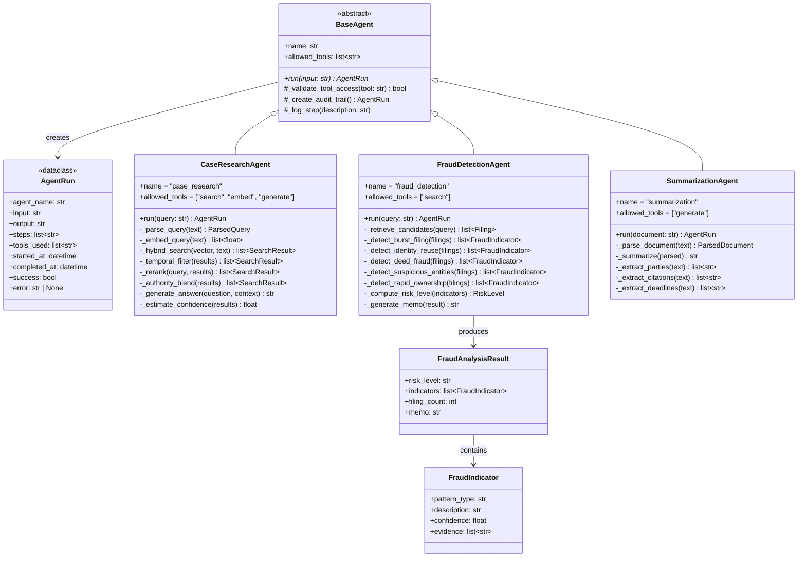
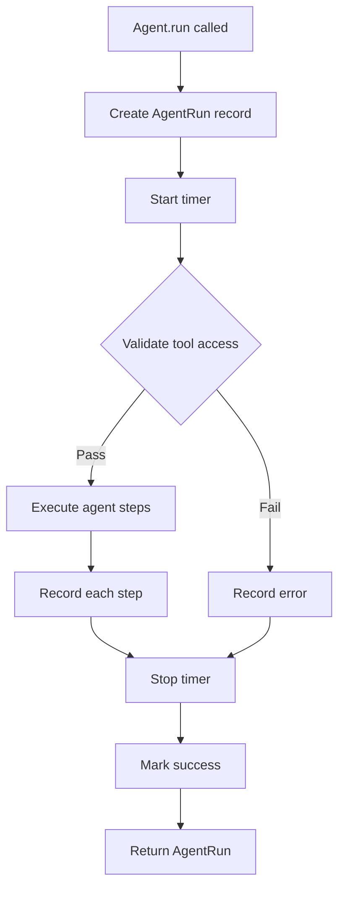
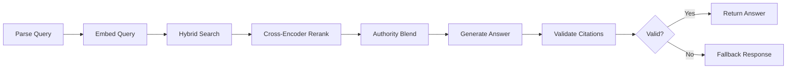
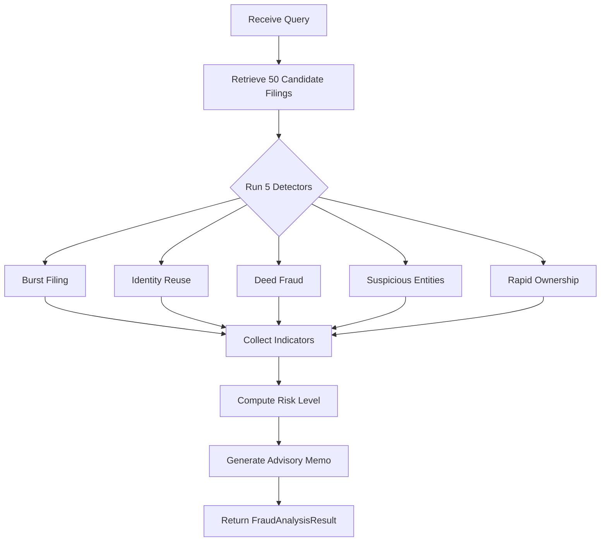
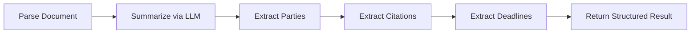
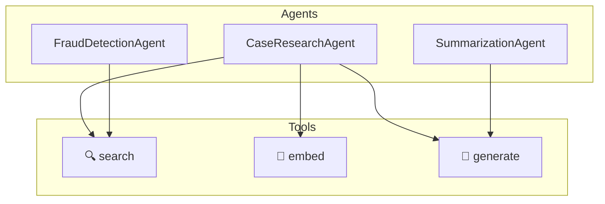
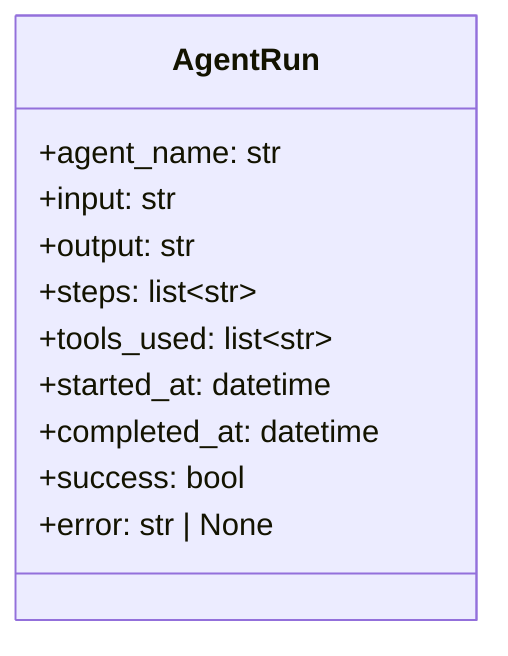

# Agent Architecture

**Project**: IndyLeg — Indiana Legal AI RAG Platform
**Version**: 0.7.0 | **Date**: April 2026

---

## Table of Contents

- [1. Overview](#1-overview)
- [2. Class Hierarchy](#2-class-hierarchy)
- [3. BaseAgent Framework](#3-baseagent-framework)
- [4. CaseResearchAgent](#4-caseresearchagent)
- [5. FraudDetectionAgent](#5-frauddetectionagent)
- [6. SummarizationAgent](#6-summarizationagent)
- [7. Tool Access Control](#7-tool-access-control)
- [8. Audit Trail Design](#8-audit-trail-design)
- [9. Pipeline Flow Diagrams](#9-pipeline-flow-diagrams)
- [10. Error Handling](#10-error-handling)
- [11. Extension Guide](#11-extension-guide)

---

## 1. Overview

The agent framework provides a structured, auditable way to orchestrate multi-step AI workflows. Each agent encapsulates a specific legal task (research, fraud detection, summarization) and follows a consistent lifecycle: validate → execute steps → audit → return result.

Key design decisions:
- **Abstract base class** enforces consistent lifecycle across all agents
- **Tool access control** restricts which system capabilities each agent may use
- **Audit trail** captures every step, tool call, and timing for accountability
- **Advisory-only outputs** — agents never take automated actions on legal data

---

## 2. Class Hierarchy



---

## 3. BaseAgent Framework

### Lifecycle



### Key Behaviors

| Behavior | Implementation |
|---|---|
| **Audit Trail** | `AgentRun` dataclass captures input, output, all steps, tools used, timing, success/failure |
| **Tool Validation** | `_validate_tool_access(tool)` checks against `allowed_tools[]` before any tool call |
| **Step Logging** | Each internal step appends to `AgentRun.steps[]` with description |
| **Error Capture** | Exceptions set `AgentRun.success = False` and `AgentRun.error = str(e)` |
| **Timing** | `started_at` and `completed_at` timestamps for performance tracking |

### Abstract Contract

```python
class BaseAgent(ABC):
    name: str
    allowed_tools: list[str]

    @abstractmethod
    async def run(self, input: str) -> AgentRun:
        """Execute the agent's task pipeline. Must be implemented by subclasses."""
```

---

## 4. CaseResearchAgent

### Purpose

Execute a 6-step RAG pipeline optimized for Indiana legal research with citation-grounded answers.

### Pipeline



### Step Details

| Step | Method | Input | Output | Notes |
|---|---|---|---|---|
| 1. Parse | `_parse_query()` | Raw text | `ParsedQuery` | Extracts jurisdiction, case_type, citations; sets query_type + weights |
| 2. Embed | `_embed_query()` | Text | `vector[1024]` | Bedrock Titan Embed v2 |
| 3. Search | `_hybrid_search()` | Vector + text | `SearchResult[]` | pgvector cosine + OpenSearch BM25 → RRF fusion (k=60) |
| 4. Rerank | `_rerank()` | Query + results | Re-scored results | ms-marco-MiniLM-L-6-v2 cross-encoder |
| 5. Authority | `_authority_blend()` | Results | Authority-ranked | `(1-α)×retrieval + α×authority` where α is adaptive |
| 6. Generate | `_generate_answer()` | Question + context | Answer text | Claude 3.5 Sonnet (temp=0.0) with [SOURCE: id] citations |

### Confidence Estimation

Confidence is estimated via score gap heuristic:
- **High (≥0.8)**: Large gap between top result and rest → strong single answer
- **Medium (0.5–0.8)**: Moderate score distribution → multiple relevant sources
- **Low (<0.5)**: Flat score distribution → uncertain retrieval quality

---

## 5. FraudDetectionAgent

### Fraud Detector Purpose

Detect anomalous filing patterns across Indiana court records using 5 specialized pattern detectors.

### Fraud Detector Pipeline



### Detector Details

| Detector | Trigger | Threshold | Evidence |
|---|---|---|---|
| **Burst Filing** | Same party files ≥N cases in 30 days | N ≥ 6 | Filing dates, party name, count |
| **Identity Reuse** | SSN, DOB, or address shared across unrelated filings | Any match | Matching fields, filing IDs |
| **Deed Fraud** | Quitclaim deed + nominal consideration ($1-$10) | Combo match | Deed type, amount, property |
| **Suspicious Entity** | Shell company patterns (numeric names, recent formation) | Pattern match | Entity name, formation date |
| **Rapid Ownership** | Property changes hands 3+ times in 90 days | ≥ 3 transfers | Property ID, transfer dates |

### Risk Level Computation

```text
Condition                                           Risk Level
──────────────────────────────────────────────────
No indicators                                       NONE
Only low-severity indicators                        LOW
Any medium-severity indicator                       MEDIUM
≥2 medium-severity indicators                       HIGH
Any high-severity indicator                         HIGH
≥2 high-severity OR (1 high + ≥3 total indicators)  CRITICAL
Any critical-severity indicator                     CRITICAL
```

### Safety Guarantees

- **Advisory only** — no automated enforcement actions
- All indicators include `confidence` score and `evidence[]`
- Results labeled with "FOR INVESTIGATIVE PURPOSES ONLY"
- Audit trail records every analysis run

---

## 6. SummarizationAgent

### Summarization Purpose

Extract structured information from legal documents including summaries, parties, citations, and deadlines.

### Summarization Pipeline



### Extraction Methods

| Extraction | Method | Approach |
|---|---|---|
| **Summary** | LLM (Claude 3.5 Sonnet) | Prompt template: `summarization` from `prompts/legal_qa.py` |
| **Parties** | Regex + NER | Pattern matching for "Plaintiff:", "Defendant:", party names |
| **Citations** | Regex | Legal citation patterns (e.g., `\d+ U.S.C. § \d+`, `\d+ Ind\. \d+`) |
| **Deadlines** | Regex + date parsing | Temporal expressions ("within 30 days", "by January 15") |

---

## 7. Tool Access Control

Each agent declares which system tools it may access. Undeclared tool usage raises an error.

### Access Matrix



| Agent | search | embed | generate |
|---|---|---|---|
| CaseResearchAgent | ✅ | ✅ | ✅ |
| FraudDetectionAgent | ✅ | ❌ | ❌ |
| SummarizationAgent | ❌ | ❌ | ✅ |

### Rationale

- **FraudDetectionAgent** only uses `search` — it does not generate text, avoiding LLM hallucination risk in fraud contexts
- **SummarizationAgent** only uses `generate` — it works on already-retrieved documents
- **CaseResearchAgent** needs all three for the full RAG pipeline

---

## 8. Audit Trail Design

### AgentRun Schema



### Example Audit Record

```json
{
    "agent_name": "case_research",
    "input": "What is the standard for summary judgment in Indiana?",
    "output": "Under Indiana Trial Rule 56(C), summary judgment is...",
    "steps": [
        "Parsed query: type=semantic, jurisdiction=indiana",
        "Embedded query: 1024-dim vector",
        "Hybrid search: 15 results from pgvector + BM25",
        "Temporal filter: removed 2 superseded documents",
        "Reranked: top 10 via cross-encoder",
        "Authority blend: α=0.3, boosted IN Supreme Court results",
        "Generated answer with 4 source citations",
        "Citation validation: all 4 citations grounded"
    ],
    "tools_used": ["search", "embed", "generate"],
    "started_at": "2026-04-15T14:30:00Z",
    "completed_at": "2026-04-15T14:30:03.2Z",
    "success": true,
    "error": null
}
```

### What Gets Audited

| Data Point | Purpose |
|---|---|
| Agent name | Which agent handled the request |
| User input | Original query for reproducibility |
| Each step | Complete pipeline trace |
| Tools used | Verify access control compliance |
| Timing | Performance monitoring |
| Success/error | Error rate tracking |
| Output | Answer for quality review |

---

## 9. Pipeline Flow Diagrams

### Complete RAG Pipeline (Research Agent)

```text
User Query
    │
    ▼
┌──────────────────────────────────────────────────────────────────┐
│ CaseResearchAgent                                                │
│                                                                  │
│  ┌──────────┐   ┌──────────┐   ┌──────────────────────────────┐ │
│  │  Parse    │──►│  Embed   │──►│       Hybrid Search          │ │
│  │  Query    │   │  Query   │   │  ┌─────────┐  ┌──────────┐  │ │
│  │          │   │ Titan v2 │   │  │pgvector │  │OpenSearch│  │ │
│  │ → type   │   │ → 1024d  │   │  │ cosine  │  │  BM25    │  │ │
│  │ → juris  │   │          │   │  └────┬────┘  └────┬─────┘  │ │
│  │ → weights│   │          │   │       └──────┬─────┘        │ │
│  └──────────┘   └──────────┘   │          RRF (k=60)         │ │
│                                └──────────────┬───────────────┘ │
│                                               │                  │
│  ┌──────────┐   ┌──────────┐   ┌─────────────▼─────────────┐   │
│  │ Generate  │◄──│ Authority│◄──│     Cross-Encoder         │   │
│  │ Answer   │   │  Blend   │   │     Reranker              │   │
│  │ Claude   │   │ (1-α)R   │   │     ms-marco-MiniLM       │   │
│  │ 3.5      │   │ + αA     │   │                           │   │
│  └─────┬────┘   └──────────┘   └───────────────────────────┘   │
│        │                                                         │
│  ┌─────▼────────────────────┐                                    │
│  │ Citation Validator       │                                    │
│  │ [SOURCE: id] → context   │                                    │
│  │ Hallucination → fallback │                                    │
│  └──────────────────────────┘                                    │
└──────────────────────────────────────────────────────────────────┘
    │
    ▼
Citation-Grounded Answer + Confidence Score
```

### Complete Fraud Pipeline

```text
User Query (party name, case number, address)
    │
    ▼
┌──────────────────────────────────────────────────────────────────┐
│ FraudDetectionAgent                                              │
│                                                                  │
│  ┌──────────────────────────────────┐                            │
│  │ Retrieve 50 Candidate Filings    │                            │
│  │ via HybridSearcher               │                            │
│  └──────────────────┬───────────────┘                            │
│                     │                                            │
│  ┌──────────────────▼───────────────────────────────────────┐    │
│  │              5 Pattern Detectors                          │    │
│  │                                                           │    │
│  │  ┌────────────┐ ┌────────────┐ ┌────────────────────┐    │    │
│  │  │ Burst      │ │ Identity   │ │ Deed Fraud         │    │    │
│  │  │ Filing     │ │ Reuse      │ │ Quitclaim+Nominal  │    │    │
│  │  │ ≥6/30 days │ │ SSN/DOB    │ │                    │    │    │
│  │  └────────────┘ └────────────┘ └────────────────────┘    │    │
│  │                                                           │    │
│  │  ┌────────────┐ ┌──────────────────┐                     │    │
│  │  │ Suspicious │ │ Rapid Ownership  │                     │    │
│  │  │ Entities   │ │ ≥3 in 90 days    │                     │    │
│  │  └────────────┘ └──────────────────┘                     │    │
│  └──────────────────────────────────────────────────────────┘    │
│                     │                                            │
│  ┌──────────────────▼───────────────┐                            │
│  │ Risk Aggregation                  │                            │
│  │ NONE → LOW → MEDIUM → HIGH       │                            │
│  └──────────────────┬───────────────┘                            │
│                     │                                            │
│  ┌──────────────────▼───────────────┐                            │
│  │ Advisory Memo Generation          │                            │
│  │ "FOR INVESTIGATIVE PURPOSES ONLY" │                            │
│  └──────────────────────────────────┘                            │
└──────────────────────────────────────────────────────────────────┘
    │
    ▼
FraudAnalysisResult { risk_level, indicators[], memo }
```

---

## 10. Error Handling

| Scenario | Handling | Fallback |
|---|---|---|
| Query parse failure | Default to semantic search type | Use raw query as-is |
| Embedding API timeout | Retry 3× with backoff | Return error to user |
| Hybrid search partial failure | Return results from available store | pgvector-only or BM25-only |
| Cross-encoder failure | Skip reranking step | Use RRF scores directly |
| Generation timeout | Return retrieved documents without answer | "I found relevant documents but couldn't generate an answer" |
| Citation validation failure | Use fallback response | "Sources found but citations could not be verified" |
| Fraud detector exception | Continue with remaining detectors | Log error; partial results with warning |

---

## 11. Extension Guide

### Adding a New Agent

1. **Create class** in `agents/` extending `BaseAgent`:

```python
from agents.base_agent import BaseAgent, AgentRun

class MyNewAgent(BaseAgent):
    name = "my_agent"
    allowed_tools = ["search"]

    async def run(self, input: str) -> AgentRun:
        run = self._create_audit_trail()
        run.input = input
        # ... implement steps ...
        return run
```

1. **Register router** in `api/routers/` to expose the agent via REST
2. **Add tests** in `tests/unit/test_my_agent.py`
3. **Update docs** — add to this document and API.md

### Adding a New Fraud Detector

1. Add method to `FraudDetectionAgent`:

```python
def _detect_new_pattern(self, filings: list) -> list[FraudIndicator]:
    indicators = []
    # ... detection logic ...
    return indicators
```

1. Call it in `run()` alongside existing detectors
2. Add to the detector table in this document
3. Add test cases in `tests/unit/test_fraud_detection.py`
