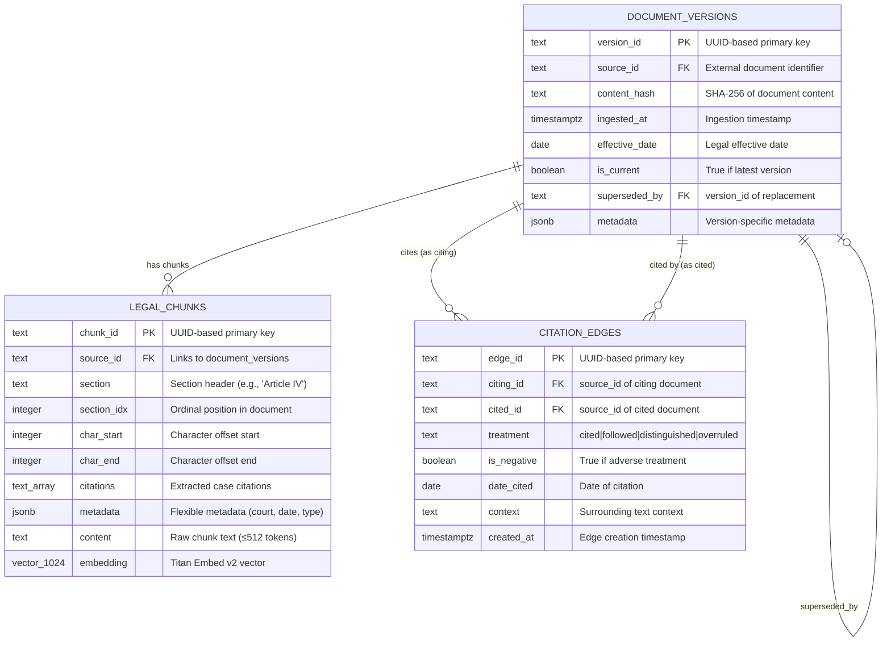
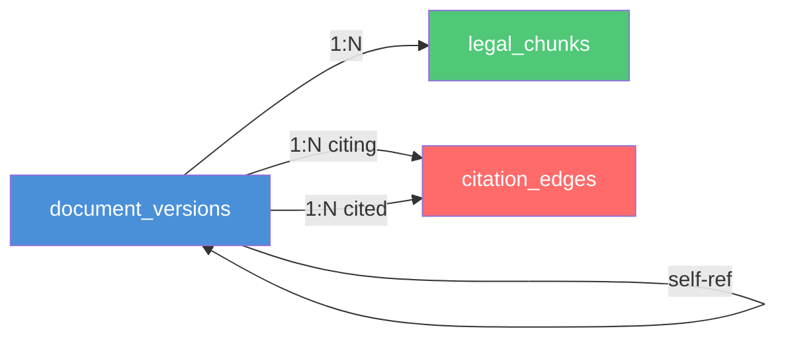
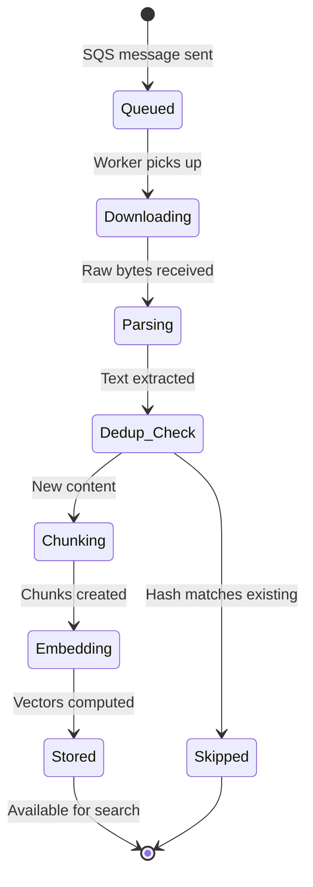

# Data Model & ER Diagrams

**Project**: IndyLeg — Indiana Legal AI RAG Platform
**Version**: 0.7.0 | **Date**: April 2026

---

## Table of Contents

- [1. Entity-Relationship Diagram](#1-entity-relationship-diagram)
- [2. Table Definitions](#2-table-definitions)
- [3. Data Dictionary](#3-data-dictionary)
- [4. Index Strategy](#4-index-strategy)
- [5. Data Lifecycle](#5-data-lifecycle)
- [6. Storage Architecture](#6-storage-architecture)

---

## 1. Entity-Relationship Diagram



### Simplified Relationship View



---

## 2. Table Definitions

### 2.1 `legal_chunks` — Vector Store

The primary table for storing chunked, embedded legal document segments.

```sql
CREATE TABLE IF NOT EXISTS legal_chunks (
    chunk_id     TEXT PRIMARY KEY,
    source_id    TEXT NOT NULL,
    section      TEXT,
    section_idx  INTEGER,
    char_start   INTEGER,
    char_end     INTEGER,
    citations    TEXT[],
    metadata     JSONB,
    content      TEXT NOT NULL,
    embedding    vector(1024)
);
```

**Relationships**:
- `source_id` → `document_versions.source_id` (logical FK — not enforced for performance)

### 2.2 `document_versions` — Version Tracking

Tracks every ingestion event for deduplication and amendment detection.

```sql
CREATE TABLE IF NOT EXISTS document_versions (
    version_id     TEXT PRIMARY KEY,
    source_id      TEXT NOT NULL,
    content_hash   TEXT NOT NULL,
    ingested_at    TIMESTAMPTZ NOT NULL DEFAULT now(),
    effective_date DATE,
    is_current     BOOLEAN NOT NULL DEFAULT TRUE,
    superseded_by  TEXT,
    metadata       JSONB
);
```

**Relationships**:
- `superseded_by` → self-referencing to `document_versions.version_id`
- `source_id` → logical parent of `legal_chunks.source_id`

### 2.3 `citation_edges` — Citation Graph

Stores directed citation relationships between legal documents for authority ranking.

```sql
CREATE TABLE IF NOT EXISTS citation_edges (
    edge_id       TEXT PRIMARY KEY,
    citing_id     TEXT NOT NULL,
    cited_id      TEXT NOT NULL,
    treatment     TEXT NOT NULL DEFAULT 'cited',
    is_negative   BOOLEAN NOT NULL DEFAULT FALSE,
    date_cited    DATE,
    context       TEXT,
    created_at    TIMESTAMPTZ NOT NULL DEFAULT now()
);
```

**Relationships**:
- `citing_id` → `document_versions.source_id`
- `cited_id` → `document_versions.source_id`
- Together with `treatment`, enables good-law validation

### Treatment Types

| Treatment | Description | is_negative |
|---|---|---|
| `cited` | Standard citation without commentary | false |
| `followed` | Cited with approval, relied upon | false |
| `distinguished` | Noted but found inapplicable | false |
| `overruled` | Directly overruled or reversed | true |

---

## 3. Data Dictionary

### 3.1 legal_chunks

| Column | Type | Nullable | Description |
|---|---|---|---|
| `chunk_id` | TEXT | NO | Primary key. Format: `{source_id}:chunk:{N}` |
| `source_id` | TEXT | NO | Parent document identifier (matches document_versions) |
| `section` | TEXT | YES | Section or article header from structured document |
| `section_idx` | INTEGER | YES | 0-based position of this chunk within its section |
| `char_start` | INTEGER | YES | Character offset of chunk start in original document |
| `char_end` | INTEGER | YES | Character offset of chunk end in original document |
| `citations` | TEXT[] | YES | Array of extracted legal citations (e.g., "42 U.S.C. § 1983") |
| `metadata` | JSONB | YES | Flexible key-value: `{court, date, case_type, jurisdiction, ...}` |
| `content` | TEXT | NO | Raw text of the chunk (max ~512 tokens, 64 overlap) |
| `embedding` | vector(1024) | YES | Titan Embed v2 embedding (1024 dimensions) |

### 3.2 document_versions

| Column | Type | Nullable | Description |
|---|---|---|---|
| `version_id` | TEXT | NO | Primary key. UUID-based identifier |
| `source_id` | TEXT | NO | External document ID (e.g., court docket number) |
| `content_hash` | TEXT | NO | SHA-256 hash of raw document content — dedup key |
| `ingested_at` | TIMESTAMPTZ | NO | Timestamp of ingestion (default: `now()`) |
| `effective_date` | DATE | YES | Legal effective date (statutes), filing date (filings) |
| `is_current` | BOOLEAN | NO | `true` if this is the latest version for this source_id |
| `superseded_by` | TEXT | YES | Points to `version_id` of the newer version |
| `metadata` | JSONB | YES | Version-specific metadata (amendment notes, etc.) |

### 3.3 citation_edges

| Column | Type | Nullable | Description |
|---|---|---|---|
| `edge_id` | TEXT | NO | Primary key. UUID-based identifier |
| `citing_id` | TEXT | NO | source_id of the document that contains the citation |
| `cited_id` | TEXT | NO | source_id of the document being cited |
| `treatment` | TEXT | NO | How the citation treats the cited case (default: 'cited') |
| `is_negative` | BOOLEAN | NO | `true` if treatment is adverse (overruled, reversed) |
| `date_cited` | DATE | YES | Date when the citation was made |
| `context` | TEXT | YES | Surrounding text providing citation context |
| `created_at` | TIMESTAMPTZ | NO | When this edge was recorded (default: `now()`) |

---

## 4. Index Strategy

### 4.1 legal_chunks Indexes

| Index Name | Column(s) | Type | Purpose |
|---|---|---|---|
| `legal_chunks_pkey` | `chunk_id` | B-tree (PK) | Primary key lookup |
| `legal_chunks_source_idx` | `source_id` | B-tree | Find all chunks for a document |
| `legal_chunks_embedding_idx` | `embedding` | IVFFlat (cosine) | Approximate nearest neighbor search |

**IVFFlat Configuration**:
- `lists = 100` — number of Voronoi partitions
- `vector_cosine_ops` — cosine similarity distance metric
- Probes at query time: `4 × k` candidates for top-k results

### 4.2 document_versions Indexes

| Index Name | Column(s) | Type | Purpose |
|---|---|---|---|
| `doc_versions_source_idx` | `source_id` | B-tree | Find all versions of a document |
| `doc_versions_current_idx` | `(source_id, is_current)` | B-tree (composite) | Fast "current version" lookup |

### 4.3 citation_edges Indexes

| Index Name | Column(s) | Type | Purpose |
|---|---|---|---|
| `citation_citing_idx` | `citing_id` | B-tree | Find all citations from a document |
| `citation_cited_idx` | `cited_id` | B-tree | Find all references to a document |

### Index Sizing Guidance

```text
Table                Rows (Est.)    Vectors     Index Memory
────────────────────────────────────────────────────────────
legal_chunks         1M chunks      1M × 1024   ~4 GB IVFFlat
document_versions    100K docs      —           ~50 MB B-tree
citation_edges       500K edges     —           ~100 MB B-tree
```

---

## 5. Data Lifecycle

### 5.1 Document Ingestion Lifecycle



### 5.2 Version Supersession

When a document is re-ingested with different content:

1. **Hash Check**: Compare `content_hash` against `document_versions`
2. **If New**: Mark old version `is_current = FALSE`, set `superseded_by`
3. **Delete Old Chunks**: Remove `legal_chunks` where `source_id` matches
4. **Insert New**: Fresh chunks + vectors for the updated content
5. **Rebuild Citations**: Re-extract citation edges from new content

### 5.3 Citation Graph Updates

```text
    Document A (ingested)
    ├── Extract citations from text
    ├── For each citation found:
    │   ├── Resolve cited document source_id
    │   ├── Determine treatment (followed/distinguished/overruled)
    │   └── INSERT INTO citation_edges
    └── Good-law check:
        └── Any edge WHERE cited_id = A AND treatment = 'overruled'
            → Mark A as potentially bad law
```

---

## 6. Storage Architecture

### 6.1 Multi-Store Design

```text
┌──────────────────────────────────────────────────────────────┐
│                     Storage Architecture                      │
│                                                              │
│  ┌─────────────────┐  ┌──────────────┐  ┌───────────────┐   │
│  │ PostgreSQL       │  │ OpenSearch   │  │ S3            │   │
│  │ + pgvector       │  │              │  │               │   │
│  │                  │  │              │  │               │   │
│  │ • legal_chunks   │  │ • BM25 index │  │ • Raw PDFs    │   │
│  │ • doc_versions   │  │ • Keyword    │  │ • Raw DOCX    │   │
│  │ • citation_edges │  │   search     │  │ • Source      │   │
│  │ • Vector search  │  │ • Faceted    │  │   archives    │   │
│  │   (cosine)       │  │   filtering  │  │               │   │
│  └─────────────────┘  └──────────────┘  └───────────────┘   │
│                                                              │
│  ┌─────────────────┐  ┌──────────────┐                      │
│  │ Redis            │  │ SQS          │                      │
│  │                  │  │              │                      │
│  │ • Rate limit     │  │ • Ingestion  │                      │
│  │   sliding window │  │   queue      │                      │
│  │ • Token revoke   │  │ • Dead      │                      │
│  │   blacklist      │  │   letter Q   │                      │
│  └─────────────────┘  └──────────────┘                      │
│                                                              │
└──────────────────────────────────────────────────────────────┘
```

### 6.2 Data Duplication Strategy

| Data | Primary Store | Secondary Store | Reason |
|---|---|---|---|
| Document text | PostgreSQL (`content`) | OpenSearch (indexed) | Keyword search requires analyzed text |
| Document vectors | PostgreSQL (`embedding`) | — | Single source of truth for ANN |
| Raw files | S3 | — | Original format preservation |
| Metadata | PostgreSQL (`metadata` JSONB) | OpenSearch (mapped) | Both stores need filter capability |
| Citations | PostgreSQL (`citations[]`, `citation_edges`) | — | Graph queries need relational store |

### 6.3 Consistency Model

- **PostgreSQL**: ACID transactions for chunk upserts and version management
- **OpenSearch**: Eventually consistent (async index refresh)
- **S3**: Read-after-write consistency
- **Redis**: Best-effort for rate limiting; eventual for revocation propagation
- **SQS**: At-least-once delivery; idempotent processing via content_hash dedup
