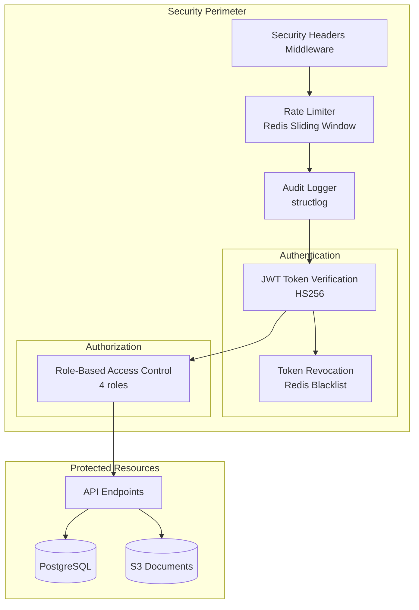
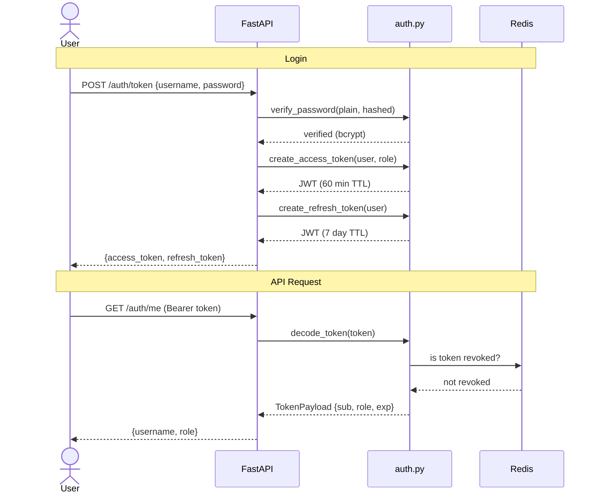
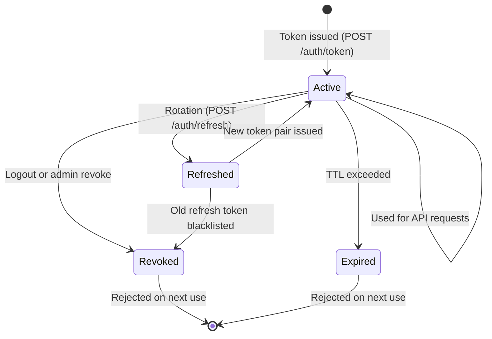
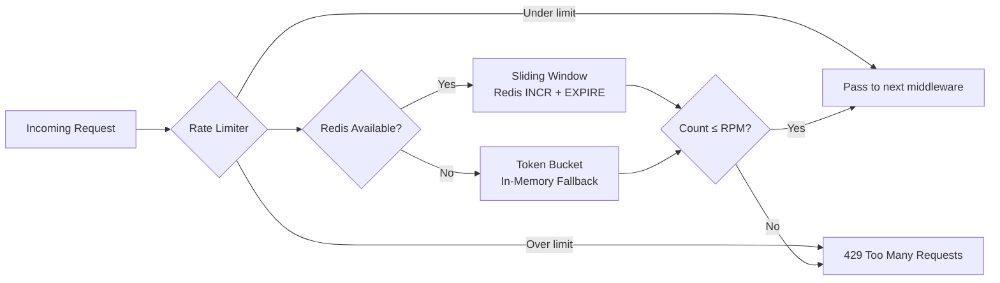
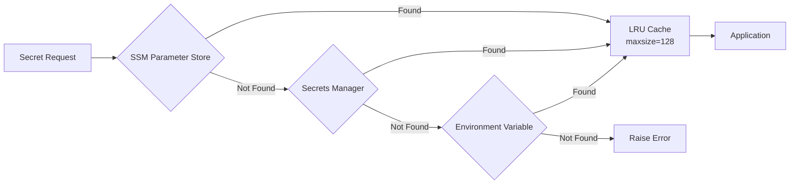

# Security Documentation

**Project**: IndyLeg — Indiana Legal AI RAG Platform
**Version**: 0.2.0 | **Date**: April 2026

---

## Table of Contents

- [1. Security Architecture Overview](#1-security-architecture-overview)
- [2. Authentication](#2-authentication)
- [3. Authorization (RBAC)](#3-authorization-rbac)
- [4. Token Management](#4-token-management)
- [5. Rate Limiting](#5-rate-limiting)
- [6. Secrets Management](#6-secrets-management)
- [7. Security Headers](#7-security-headers)
- [8. Audit Logging](#8-audit-logging)
- [9. Data Protection](#9-data-protection)
- [10. Threat Model](#10-threat-model)
- [11. OWASP Top 10 Mitigations](#11-owasp-top-10-mitigations)

---

## 1. Security Architecture Overview



---

## 2. Authentication

### JWT Token Flow



### Token Structure

```json
{
    "sub": "username",
    "role": "ATTORNEY",
    "type": "access",
    "exp": 1713200400,
    "iat": 1713196800
}
```

| Field | Description |
|---|---|
| `sub` | Username (subject) |
| `role` | One of: ADMIN, ATTORNEY, CLERK, VIEWER |
| `type` | `access` or `refresh` |
| `exp` | Expiration timestamp (Unix) |
| `iat` | Issued-at timestamp (Unix) |

### Password Security

- **Algorithm**: bcrypt via `passlib`
- **Rounds**: Default 12 (configurable)
- **Storage**: Hashed passwords only — plaintext never stored or logged

---

## 3. Authorization (RBAC)

### Role Definitions

| Role | Description | Permissions |
|---|---|---|
| **ADMIN** | System administrator | Full access: all endpoints + token revocation + metrics |
| **ATTORNEY** | Legal professional | Search, ask, fraud analysis, document ingestion |
| **CLERK** | Court clerk | Search, ask |
| **VIEWER** | Read-only observer | Search only |

### Endpoint Access Matrix

| Endpoint | ADMIN | ATTORNEY | CLERK | VIEWER |
|---|---|---|---|---|
| POST `/auth/token` | ✅ | ✅ | ✅ | ✅ |
| POST `/auth/refresh` | ✅ | ✅ | ✅ | ✅ |
| POST `/auth/logout` | ✅ | ✅ | ✅ | ✅ |
| POST `/auth/revoke` | ✅ | ❌ | ❌ | ❌ |
| GET `/auth/me` | ✅ | ✅ | ✅ | ✅ |
| POST `/search` | ✅ | ✅ | ✅ | ✅ |
| POST `/search/ask` | ✅ | ✅ | ✅ | ❌ |
| POST `/fraud/analyze` | ✅ | ✅ | ❌ | ❌ |
| POST `/documents/ingest` | ✅ | ✅ | ❌ | ❌ |
| GET `/health` | ✅ | ✅ | ✅ | ✅ |
| GET `/metrics` | ✅ | ❌ | ❌ | ❌ |
| GET `/metrics/json` | ✅ | ❌ | ❌ | ❌ |

### Enforcement

```python
@router.post("/documents/ingest")
async def ingest_document(
    request: IngestRequest,
    current_user: User = Depends(require_role(Role.ADMIN, Role.ATTORNEY)),
):
    ...
```

The `require_role()` dependency checks the user's JWT role claim against the list of allowed roles. Returns 403 if unauthorized.

---

## 4. Token Management

### Token Lifecycle



### Token Types & TTLs

| Token Type | TTL | Rotation |
|---|---|---|
| Access Token | 60 minutes | Not rotated — new one issued on refresh |
| Refresh Token | 7 days | Rotated on every refresh (old one revoked) |

### Revocation System

**Primary**: Redis blacklist
- Token added to Redis SET with TTL matching remaining token lifetime
- Checked on every authenticated request via `is_token_revoked()`
- Memory-efficient: only stores token JTI, not full token

**Fallback**: In-memory set
- If Redis is unavailable, tokens are stored in a Python set
- Cleared on application restart (safe because tokens have short TTL)
- Automatic fallback — no configuration needed

```text
Request → Decode JWT → Check Redis blacklist ─┬─ Not revoked → Proceed
                                               └─ Revoked → 401 Unauthorized

If Redis unavailable:
Request → Decode JWT → Check in-memory set ─┬─ Not revoked → Proceed
                                             └─ Revoked → 401 Unauthorized
```

### Refresh Token Rotation

On every refresh:
1. Verify the refresh token is valid and not revoked
2. **Revoke** the old refresh token (add to blacklist)
3. Issue **new** access token + **new** refresh token
4. Return the new pair

This ensures stolen refresh tokens have limited reuse window.

---

## 5. Rate Limiting

### Architecture



### Configuration

| Parameter | Default | Description |
|---|---|---|
| `RATE_LIMIT_RPM` | 60 | Maximum requests per minute per client |
| `REDIS_URL` | `redis://localhost:6379` | Redis connection for sliding window |

### Sliding Window (Redis)

```text
Key: rate_limit:{client_ip}:{minute_bucket}
Operation: INCR key → SET EXPIRE 60s → CHECK count ≤ RPM
```

### Token Bucket (Fallback)

When Redis is unavailable, an in-memory token bucket algorithm is used:
- Each client IP gets a bucket of `RPM` tokens
- Tokens replenish at `RPM/60` per second
- Request consumes 1 token; empty bucket → 429

### Response Headers

```text
X-RateLimit-Limit: 60
X-RateLimit-Remaining: 45
X-RateLimit-Reset: 1713200460
```

---

## 6. Secrets Management

### Resolution Cascade



### SSM Parameter Naming

```text
/indyleg/{environment}/{key}

Examples:
/indyleg/production/jwt_secret_key
/indyleg/production/database_url
/indyleg/staging/bedrock_api_key
```

### Secrets Manager Naming

```text
indyleg/{environment}/{key}

Examples:
indyleg/production/jwt_secret_key
indyleg/production/database_credentials
```

### Caching

- **LRU Cache**: maxsize=128 entries
- **Purpose**: Avoid repeated API calls to SSM/Secrets Manager
- **Invalidation**: Application restart or manual cache clear

### What Should Be a Secret

| Secret | Storage | Why |
|---|---|---|
| `JWT_SECRET_KEY` | SSM / Secrets Manager | Token signing key — must not be in code |
| `DATABASE_URL` | SSM / Secrets Manager | Contains database credentials |
| `REDIS_URL` | SSM / Secrets Manager | May contain auth credentials |
| `AWS_ACCESS_KEY_ID` | IAM Role (not stored) | Use instance roles in production |

---

## 7. Security Headers

Applied by `SecurityHeadersMiddleware` to every response:

| Header | Value | Purpose |
|---|---|---|
| `X-Content-Type-Options` | `nosniff` | Prevent MIME type sniffing |
| `X-Frame-Options` | `DENY` | Prevent clickjacking |
| `X-XSS-Protection` | `1; mode=block` | Legacy XSS protection |
| `Strict-Transport-Security` | `max-age=31536000; includeSubDomains` | Force HTTPS |
| `Content-Security-Policy` | `default-src 'self'` | Restrict resource loading |
| `Referrer-Policy` | `strict-origin-when-cross-origin` | Control referrer information |
| `Permissions-Policy` | `geolocation=(), camera=(), microphone=()` | Disable unnecessary browser APIs |

---

## 8. Audit Logging

### What Is Logged

| Event | Data Captured |
|---|---|
| Authentication attempt | username, success/fail, IP, timestamp |
| API request | method, path, user_id, IP, status_code, latency |
| Agent execution | agent_name, input, output, steps[], tools_used[], timing |
| Token revocation | token_id, revoked_by, reason |
| Document ingestion | source_url, document_type, user_id |
| Rate limit hit | client_ip, endpoint, current_count |

### Log Format

**Production** (JSON):
```json
{
    "event": "api_request",
    "method": "POST",
    "path": "/search/ask",
    "user_id": "attorney1",
    "status_code": 200,
    "latency_ms": 2340,
    "timestamp": "2026-04-15T14:30:00Z",
    "request_id": "abc123"
}
```

**Development** (Pretty):
```text
2026-04-15 14:30:00 [info] api_request method=POST path=/search/ask user_id=attorney1 status=200 latency=2340ms
```

### Log Library

- **structlog** — structured logging with JSON output in production
- Configured in `config/logging.py`
- Request ID propagation via middleware

---

## 9. Data Protection

### Data at Rest

| Store | Encryption | Details |
|---|---|---|
| PostgreSQL (Aurora) | AES-256 | AWS-managed encryption at rest |
| OpenSearch | AES-256 | AWS encryption at rest enabled by default |
| S3 | SSE-S3 or SSE-KMS | Server-side encryption on all objects |
| Redis (ElastiCache) | AES-256 | Encryption at rest + in-transit |

### Data in Transit

| Communication | Protocol | Details |
|---|---|---|
| Client ↔ ALB | HTTPS (TLS 1.2+) | ACM certificate on load balancer |
| ALB ↔ API | HTTP (VPC internal) | Private subnet only |
| API ↔ PostgreSQL | TLS | `sslmode=require` in connection string |
| API ↔ OpenSearch | HTTPS | Fine-grained access control |
| API ↔ Bedrock | HTTPS | AWS SDK TLS |
| API ↔ Redis | TLS | `rediss://` scheme for encrypt transport |

### Sensitive Data Handling

- **Passwords**: bcrypt hashed, never stored in plaintext
- **JWT Tokens**: Not logged; only token ID (JTI) appears in audit logs
- **PII in filings**: Stored as-received from court systems; no additional PII collection
- **Query inputs**: Logged for audit but not exported to external systems

---

## 10. Threat Model

### STRIDE Analysis

| Threat | Category | Scenario | Mitigation |
|---|---|---|---|
| Token theft | **S**poofing | Attacker steals JWT from client | Short TTL (60 min); revocation; HTTPS-only |
| Privilege escalation | **T**ampering | User modifies JWT role claim | HS256 signature verification; server-side role check |
| Repudiation | **R**epudiation | User denies performing an action | Comprehensive audit logging with structlog |
| Data exfiltration | **I**nformation Disclosure | Unauthorized access to legal docs | RBAC; encrypted storage; VPC isolation |
| DDoS / abuse | **D**enial of Service | Flood API with requests | Rate limiting (Redis + fallback); ALB throttling |
| SQL injection | **E**levation of Privilege | Malicious SQL in query params | Parameterized queries; Pydantic validation |

### Attack Surface

```text
Internet
    │
    ▼
┌──────────────┐
│     ALB      │  ← TLS termination, health checks
│  (public)    │
└──────┬───────┘
       │ HTTP (port 8000)
┌──────▼───────┐
│   ECS API    │  ← Security headers, rate limiting, JWT auth
│  (private)   │
└──────┬───────┘
       │ Internal
┌──────▼───────┐
│  PostgreSQL  │  ← VPC-only, no public endpoint
│  OpenSearch  │  ← VPC-only, fine-grained access
│  Redis       │  ← VPC-only, auth required
└──────────────┘
```

---

## 11. OWASP Top 10 Mitigations

| # | Vulnerability | Status | Mitigation |
|---|---|---|---|
| A01 | Broken Access Control | ✅ Mitigated | RBAC with `require_role()` decorator; JWT verification on every request |
| A02 | Cryptographic Failures | ✅ Mitigated | bcrypt for passwords; HS256 JWT; TLS everywhere; AES-256 at rest |
| A03 | Injection | ✅ Mitigated | Parameterized SQL queries (psycopg); Pydantic input validation |
| A04 | Insecure Design | ✅ Mitigated | Citation validation prevents hallucination; advisory-only fraud output |
| A05 | Security Misconfiguration | ✅ Mitigated | Security headers middleware; restrictive CORS; secrets in SSM |
| A06 | Vulnerable Components | ✅ Mitigated | Upper-bounded pins in pyproject.toml; requirements.lock for reproducibility; Dependabot weekly PRs (pip, npm, GH Actions); CI pip-audit + npm audit on every push |
| A07 | Auth Failures | ✅ Mitigated | Token rotation; revocation; rate limiting on auth endpoints |
| A08 | Data Integrity Failures | ✅ Mitigated | Content-hash deduplication; citation validation; signed JWTs |
| A09 | Logging Failures | ✅ Mitigated | structlog audit trail; request/response logging; agent step logging |
| A10 | SSRF | ✅ Mitigated | Document sources use allowlisted API endpoints only; no user-supplied URLs to internal services |
