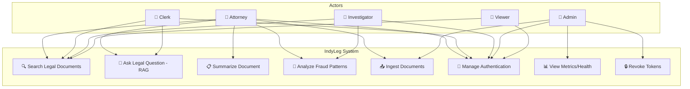
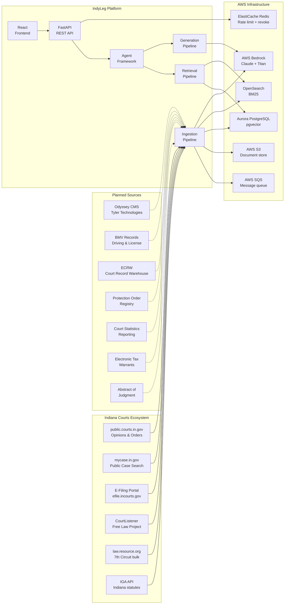

# System Analysis Document

**Project**: IndyLeg — Indiana Legal AI RAG Platform
**Version**: 0.7.0 | **Date**: April 2026

---

## Table of Contents

- [1. Problem Statement](#1-problem-statement)
- [2. Stakeholder Analysis](#2-stakeholder-analysis)
- [3. Requirements Analysis](#3-requirements-analysis)
- [4. Use Case Analysis](#4-use-case-analysis)
- [5. Data Flow Analysis](#5-data-flow-analysis)
- [6. System Context Diagram](#6-system-context-diagram)
- [7. Constraints & Assumptions](#7-constraints--assumptions)
- [8. Risk Analysis](#8-risk-analysis)

---

## 1. Problem Statement

Indiana legal professionals (attorneys, court clerks, researchers) currently lack a centralized, AI-assisted tool for:

1. **Legal Research**: Searching across court filings, statutes, and opinions with semantic understanding — existing keyword-based tools miss context and synonyms.
2. **Citation Verification**: Ensuring that cited cases are still "good law" (not overruled/reversed) requires manual cross-referencing across multiple databases.
3. **Fraud Detection**: Identifying anomalous filing patterns (burst filing, identity reuse, deed fraud) across thousands of records is manual and error-prone.
4. **Document Summarization**: Extracting key parties, deadlines, and citations from lengthy legal documents is time-consuming.

IndyLeg addresses these problems by combining Retrieval-Augmented Generation (RAG) with Indiana-specific court hierarchy knowledge and pattern detection algorithms.

---

## 2. Stakeholder Analysis

```text
┌─────────────────────────────────────────────────────────────────────┐
│                       STAKEHOLDER MAP                               │
├─────────────────┬──────────────────┬────────────────────────────────┤
│   Stakeholder   │      Role        │           Needs                │
├─────────────────┼──────────────────┼────────────────────────────────┤
│ Attorneys       │ Primary user     │ Fast, accurate legal research  │
│                 │ (ATTORNEY role)  │ with citation-grounded answers │
├─────────────────┼──────────────────┼────────────────────────────────┤
│ Court Clerks    │ Document manager │ Streamlined document ingestion │
│                 │ (CLERK role)     │ and metadata management        │
├─────────────────┼──────────────────┼────────────────────────────────┤
│ Investigators   │ Fraud analyst    │ Pattern detection across       │
│                 │ (ATTORNEY role)  │ filings with audit trails      │
├─────────────────┼──────────────────┼────────────────────────────────┤
│ Administrators  │ System operator  │ System health, user management │
│                 │ (ADMIN role)     │ deployment, security oversight │
├─────────────────┼──────────────────┼────────────────────────────────┤
│ Viewers         │ Read-only access │ Search and read results only   │
│                 │ (VIEWER role)    │                                │
└─────────────────┴──────────────────┴────────────────────────────────┘
```

---

## 3. Requirements Analysis

### 3.1 Functional Requirements

| ID | Category | Requirement | Priority |
|---|---|---|---|
| FR-01 | Search | Hybrid vector + keyword search over legal documents | Must |
| FR-02 | Search | Jurisdiction and case-type filtering | Must |
| FR-03 | RAG | Citation-grounded answer generation using LLM | Must |
| FR-04 | RAG | Source validation — every claim traceable to a document | Must |
| FR-05 | Ranking | Indiana court hierarchy-aware authority ranking | Must |
| FR-06 | Ranking | Citation graph with good-law validation | Should |
| FR-07 | Fraud | Burst filing detection (≥6 filings/30 days) | Must |
| FR-08 | Fraud | Identity reuse detection (SSN, DOB, address) | Must |
| FR-09 | Fraud | Deed fraud pattern detection (quitclaim + nominal value) | Must |
| FR-10 | Fraud | Suspicious entity detection (numeric shell companies) | Should |
| FR-11 | Fraud | Rapid ownership transfer detection (3+ in 90 days) | Should |
| FR-12 | Ingestion | Ingest from Indiana Courts API (Odyssey) | Must |
| FR-13 | Ingestion | Ingest from CourtListener, law.resource.org, IGA | Should |
| FR-14 | Ingestion | Structure-aware document chunking | Must |
| FR-15 | Ingestion | Content-hash deduplication | Must |
| FR-16 | Auth | JWT-based authentication with role-based access | Must |
| FR-17 | Auth | Token refresh rotation and revocation | Should |
| FR-18 | Summary | Structured extraction (parties, citations, deadlines) | Should |
| FR-19 | UI | Chat interface for legal Q&A | Must |
| FR-20 | UI | Fraud analysis interface with risk visualization | Should |

### 3.2 Non-Functional Requirements

| ID | Category | Requirement | Target |
|---|---|---|---|
| NFR-01 | Performance | Search latency p95 | < 2 seconds |
| NFR-02 | Performance | RAG answer latency p95 | < 5 seconds |
| NFR-03 | Performance | Ingestion throughput | ≥ 100 docs/min |
| NFR-04 | Availability | API uptime | 99.9% |
| NFR-05 | Scalability | Concurrent users | 50+ simultaneous |
| NFR-06 | Scalability | Document corpus | 1M+ chunks |
| NFR-07 | Security | OWASP Top 10 compliance | All mitigated |
| NFR-08 | Security | Audit trail for all agent runs | 100% coverage |
| NFR-09 | Accuracy | Citation accuracy (no hallucinations) | > 95% |
| NFR-10 | Accuracy | Retrieval recall@10 | > 80% |

---

## 4. Use Case Analysis

### Use Case Diagram (Mermaid)



### UC-01: Search Legal Documents

| Field | Value |
|---|---|
| **Actor** | Attorney, Clerk, Investigator, Viewer |
| **Precondition** | User is authenticated |
| **Main Flow** | 1. User enters search query with optional jurisdiction filter |
| | 2. System parses query, detects case type and citations |
| | 3. System runs hybrid vector + BM25 search |
| | 4. System re-ranks via cross-encoder + authority ranker |
| | 5. System returns ranked results with source metadata |
| **Postcondition** | User sees relevance-scored, authority-ranked results |

### UC-02: Ask Legal Question (RAG)

| Field | Value |
|---|---|
| **Actor** | Attorney, Clerk |
| **Precondition** | User is authenticated |
| **Main Flow** | 1. User enters natural language legal question |
| | 2. CaseResearchAgent executes 6-step pipeline |
| | 3. System generates answer with [SOURCE: id] citations |
| | 4. CitationValidator verifies all citations are grounded |
| | 5. System returns answer with confidence level |
| **Alt Flow** | 4a. If hallucinated citations detected → return fallback |
| **Postcondition** | User receives citation-grounded legal answer |

### UC-03: Analyze Fraud Patterns

| Field | Value |
|---|---|
| **Actor** | Attorney, Investigator |
| **Precondition** | User is authenticated |
| **Main Flow** | 1. User enters query (party name, case number, address) |
| | 2. FraudDetectionAgent retrieves 50 candidate filings |
| | 3. System runs 5 pattern detectors in sequence |
| | 4. System computes risk level and generates memo |
| | 5. System returns result with advisory flags |
| **Postcondition** | User sees risk assessment with detected indicators |
| **Note** | All results are strictly advisory — no automated actions |

### UC-04: Ingest Documents

| Field | Value |
|---|---|
| **Actor** | Admin, Attorney |
| **Precondition** | User has ADMIN or ATTORNEY role |
| **Main Flow** | 1. User submits document source URL and metadata |
| | 2. System queues ingestion message to SQS |
| | 3. Worker downloads, parses, chunks, embeds |
| | 4. Worker stores vectors in pgvector + keywords in OpenSearch |
| **Alt Flow** | 3a. If content hash matches existing → skip (dedup) |
| **Postcondition** | Document searchable via hybrid retrieval |

---

## 5. Data Flow Analysis

### Level 0: Context Diagram

```text
┌──────────────┐                              ┌──────────────┐
│   External   │   Court filings, opinions     │   IndyLeg    │
│   Data       ├─────────────────────────────►│   System     │
│   Sources    │                              │              │
└──────────────┘                              │              │
                                              │              │
┌──────────────┐   Query / Question           │              │
│   Legal      ├─────────────────────────────►│              │
│   Users      │                              │              │
│              │◄─────────────────────────────┤              │
│              │   Answers / Results / Alerts  │              │
└──────────────┘                              └──────┬───────┘
                                                     │
                                              ┌──────▼───────┐
                                              │  AWS Cloud   │
                                              │  (Bedrock,   │
                                              │   S3, SQS)   │
                                              └──────────────┘
```

### Level 1: Major Processes

```text
┌──────────────────────────────────────────────────────────────┐
│                        IndyLeg System                        │
│                                                              │
│  ┌─────────────┐    ┌──────────────┐    ┌───────────────┐   │
│  │ P1: Ingest  │───►│ P2: Store &  │◄──►│ P3: Retrieve  │   │
│  │ Documents   │    │ Index        │    │ & Search      │   │
│  └─────────────┘    └──────────────┘    └───────┬───────┘   │
│                                                  │           │
│  ┌─────────────┐    ┌──────────────┐    ┌───────▼───────┐   │
│  │ P6: Monitor │    │ P5: Detect   │◄───│ P4: Generate  │   │
│  │ & Report    │    │ Fraud        │    │ Answers       │   │
│  └─────────────┘    └──────────────┘    └───────────────┘   │
│                                                              │
└──────────────────────────────────────────────────────────────┘
```

### Level 2: Ingestion Process Detail

```text
P1: Ingest Documents
│
├─► P1.1: Discover
│         ✅ Active:  public.courts.in.gov API, mycase.in.gov,
│                     CourtListener, law.resource.org, IGA, E-Filing
│         🔶 Planned: Odyssey CMS (Tyler), BMV Records, ECRW,
│                     Protection Order Registry, Court Statistics,
│                     Tax Warrants, Abstract of Judgment
│         → CourtCase, PublicLegalOpinion, IndianaStatute,
│           MyCaseSearchResult, FilingRecord
│
├─► P1.2: Queue (SQS IngestionMessage)
│         → source_type, source_id, download_url
│
├─► P1.3: Download & Parse (Worker)
│         → ParsedDocument (PDF, DOCX, HTML, TXT)
│
├─► P1.4: Deduplicate (content hash check)
│         → Skip if document_versions hash matches
│
├─► P1.5: Chunk (LegalChunker — structure-aware)
│         → Chunk[] with section headers, citations
│
├─► P1.6: Embed (Bedrock Titan v2, batch=128)
│         → (Chunk, vector[1024])[]
│
└─► P1.7: Store (VectorIndexer)
          → pgvector, OpenSearch, S3
```

### Level 2: Query Process Detail

```text
P3+P4: Search & Generate
│
├─► P3.1: Parse Query (QueryParser)
│         → ParsedQuery: jurisdiction, case_type, citations,
│           query_type (citation_lookup/semantic/hybrid),
│           adaptive bm25_weight, authority_alpha
│
├─► P3.2: Embed Query (Bedrock Titan v2)
│         → query_vector[1024]
│
├─► P3.3: Hybrid Search (HybridSearcher)
│         → pgvector cosine + OpenSearch BM25
│         → Reciprocal Rank Fusion (k=60)
│
├─► P3.4: Temporal Filter (if query implies "current law")
│         → Remove expired/superseded documents
│
├─► P3.5: Cross-Encoder Rerank (ms-marco-MiniLM-L-6-v2)
│         → Score top candidates jointly
│
├─► P3.6: Authority Rank (AuthorityRanker)
│         → Blend: (1-α)×retrieval + α×authority
│
├─► P4.1: Generate (Bedrock Claude 3.5 Sonnet, temp=0.0)
│         → Answer with [SOURCE: id] citations
│
└─► P4.2: Validate (CitationValidator)
          → Check every citation maps to retrieved chunk
          → Reject hallucinated citations → fallback response
```

---

## 6. System Context Diagram



---

## 7. Constraints & Assumptions

### Constraints

| ID | Constraint | Impact |
|---|---|---|
| C-01 | Indiana Courts API rate limits (unknown exact limit) | Semaphore (max 5 concurrent) + exponential backoff |
| C-02 | Bedrock model availability (regional) | Deploy in us-east-1 where all models available |
| C-03 | pgvector single-node IVFFLAT recall | Use lists=100, probe top 4×k candidates |
| C-04 | LLM output non-determinism | Temperature=0.0 for maximum reproducibility |
| C-05 | Legal compliance — all answers must be traceable | Citation validation rejects hallucinations |
| C-06 | Budget — minimize Bedrock API costs | Batch embeddings, cache where possible |

### Assumptions

| ID | Assumption | Risk if False |
|---|---|---|
| A-01 | Indiana Courts API and mycase.in.gov will remain publicly available | Would need alternative data sources; see INDIANA_COURTS_ECOSYSTEM.md for fallback mapping |
| A-02 | Court filings are in English and machine-parseable | OCR pipeline would be needed for scanned docs |
| A-03 | Users have basic legal knowledge to interpret results | Misuse of advisory fraud results |
| A-04 | Bedrock model quality will remain stable across versions | Answer quality regression |
| A-05 | 1024-dim embeddings sufficient for legal domain | May need domain-fine-tuned model |

---

## 8. Risk Analysis

| Risk | Likelihood | Impact | Mitigation |
|---|---|---|---|
| LLM hallucination in legal context | Medium | Critical | CitationValidator rejects ungrounded claims; fallback response |
| Stale case law (overruled precedent) | Medium | High | CitationGraph good-law validation; temporal filtering |
| API data source unavailability | Low | High | 6+ active sources (Courts API, mycase.in.gov, E-Filing, CourtListener, law.resource.org, IGA); graceful degradation; see INDIANA_COURTS_ECOSYSTEM.md |
| Bedrock throttling at scale | Medium | Medium | Batch embeddings; request queuing; retry with backoff |
| Fraud false positives causing investigation waste | Medium | Medium | Conservative thresholds; confidence scores; "advisory only" labeling |
| Token/credential compromise | Low | Critical | Short-lived tokens (60 min); revocation; Redis blacklist |
| Data breach via SQL injection | Low | Critical | Parameterized queries only; Pydantic validation at boundaries |
| Single-region outage | Low | High | CDK allows multi-region deployment; Aurora Multi-AZ |
