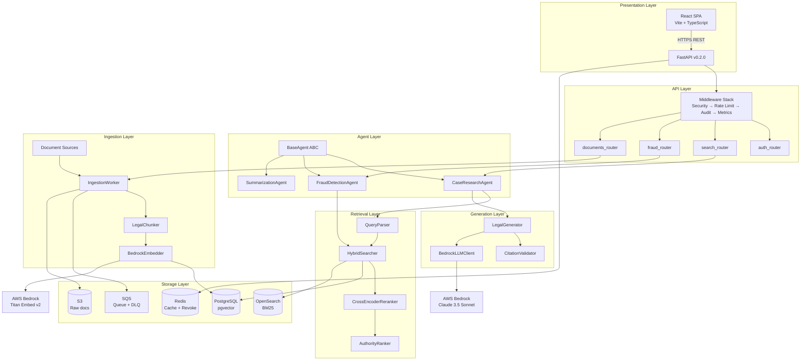
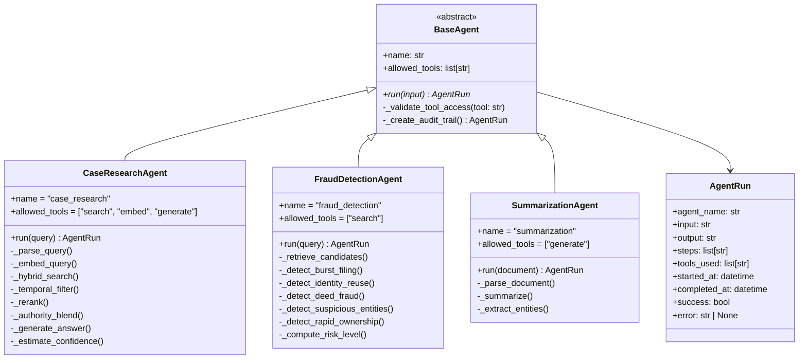
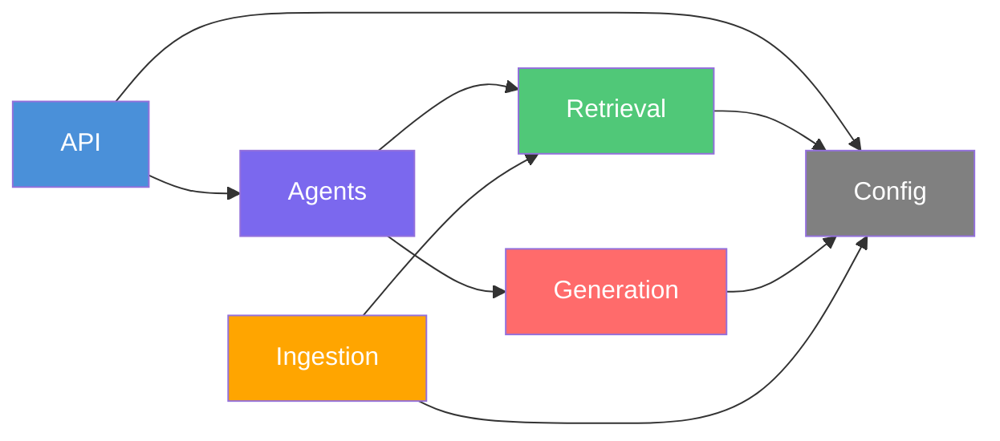
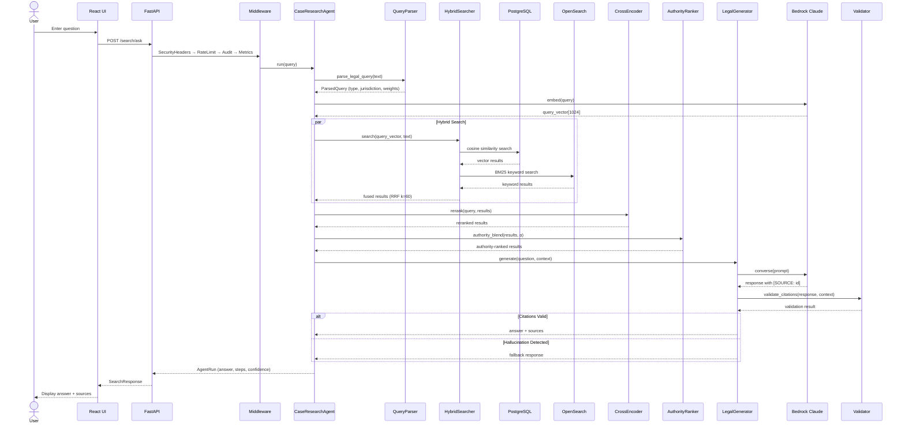
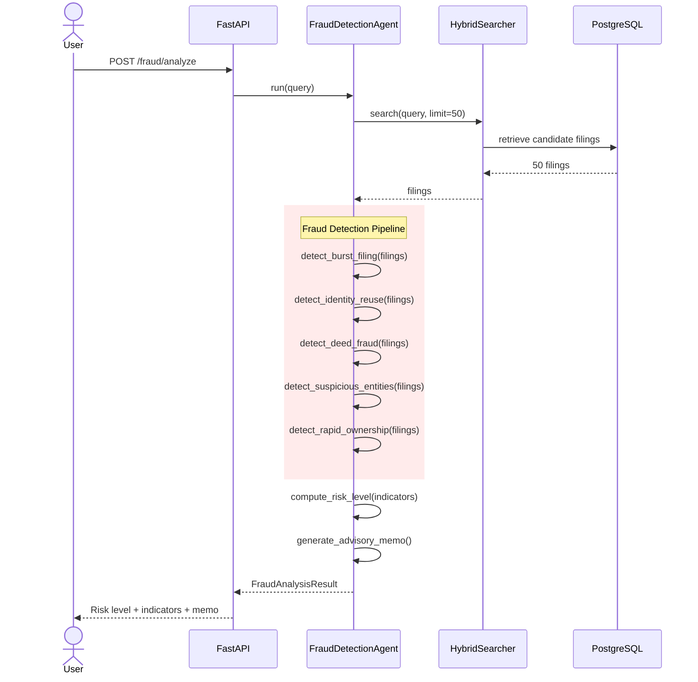
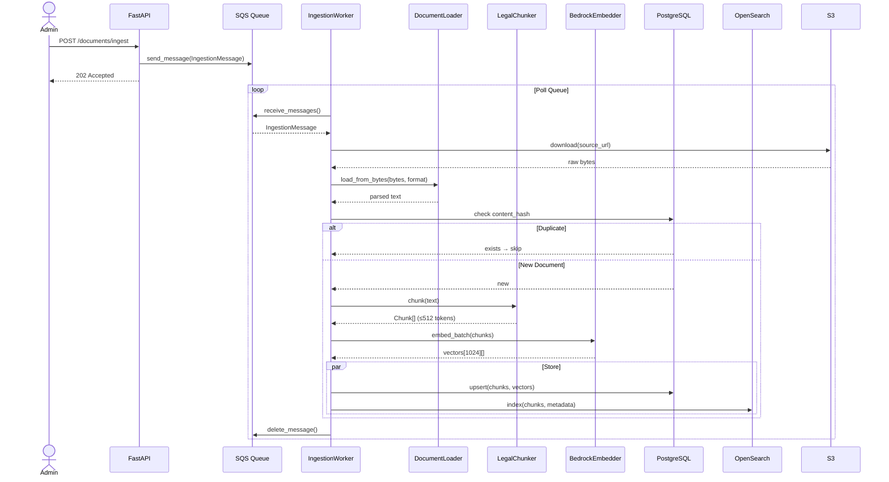
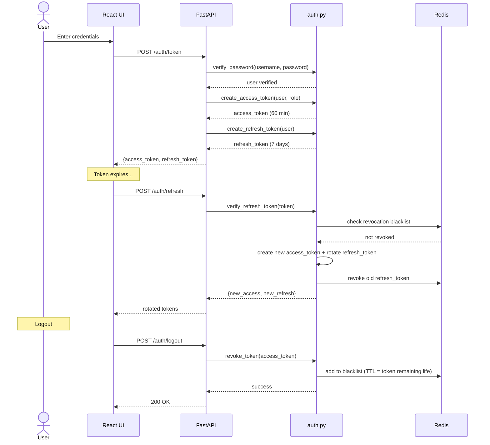

# System Design Document

**Project**: IndyLeg — Indiana Legal AI RAG Platform
**Version**: 0.2.0 | **Date**: April 2026

---

## Table of Contents

- [1. Design Philosophy](#1-design-philosophy)
- [2. High-Level Architecture](#2-high-level-architecture)
- [3. Component Design](#3-component-design)
- [4. Module Interactions](#4-module-interactions)
- [5. Sequence Diagrams](#5-sequence-diagrams)
- [6. Design Patterns](#6-design-patterns)
- [7. Interface Specifications](#7-interface-specifications)
- [8. Error Handling Strategy](#8-error-handling-strategy)
- [9. Configuration Management](#9-configuration-management)

---

## 1. Design Philosophy

| Principle | Application |
|---|---|
| **Modular Layering** | Six isolated layers (API → Agents → Retrieval → Generation → Ingestion → Infrastructure) with clean interfaces |
| **Fail-Safe Generation** | LLM outputs validated before delivery; hallucinations rejected with fallback responses |
| **Domain-Driven** | Legal domain concepts (court hierarchy, authority, citations) first-class in the retrieval pipeline |
| **Async-First** | All I/O-bound operations use `async/await`; SQS decouples ingestion from serving |
| **Progressive Degradation** | Redis unavailable → in-memory fallback; Bedrock timeout → cached response; source down → alternate source |
| **Zero-Trust Security** | JWT validation on every request, RBAC enforcement, audit logging, token revocation |

---

## 2. High-Level Architecture



---

## 3. Component Design

### 3.1 API Layer

**Module**: `api/`

The API layer is a FastAPI application that exposes all system functionality over REST.

#### Middleware Stack (order matters)

```text
Request → SecurityHeaders → RateLimiter → AuditLogger → MetricsCollector → CORS → Router
```

| Middleware | Responsibility | Key Details |
|---|---|---|
| `SecurityHeaders` | Inject security headers (CSP, HSTS, X-Frame-Options) | Applied to every response |
| `RateLimiter` | Sliding window rate limiting | Redis primary, in-memory token bucket fallback |
| `AuditLogger` | Structured request/response logging | structlog JSON, includes user_id if authenticated |
| `MetricsCollector` | Prometheus counter/histogram collection | Request count, latency by endpoint + method |
| `CORSMiddleware` | Cross-origin policy | Configurable allowed_origins |

#### Routers

| Router | Prefix | Key Endpoints |
|---|---|---|
| `auth_router` | `/auth` | POST `/token`, `/refresh`, `/logout`, `/revoke`; GET `/me` |
| `search` | `/search` | POST `/search`, POST `/search/ask` |
| `fraud` | `/fraud` | POST `/fraud/analyze` |
| `documents` | `/documents` | POST `/documents/ingest` (ADMIN/ATTORNEY) |

### 3.2 Agent Layer

**Module**: `agents/`

#### Class Hierarchy



### 3.3 Retrieval Layer

**Module**: `retrieval/`

#### Pipeline Components

| Component | Class | Responsibility |
|---|---|---|
| Query Parser | `QueryParser` | Extracts jurisdiction, case_type, citations; classifies query type; sets adaptive weights |
| Hybrid Searcher | `HybridSearcher` | Runs cosine + BM25 in parallel; fuses via RRF (k=60) |
| Cross-Encoder | `CrossEncoderReranker` | Joint passage-query scoring with ms-marco-MiniLM-L-6-v2 |
| Authority Ranker | `AuthorityRanker` | Court hierarchy weighting; citation graph PageRank |
| RAG Evaluator | `RAGEvaluator` | Offline metrics: recall@K, precision@K, MRR, NDCG |
| Vector Indexer | `VectorIndexer` | PostgreSQL schema management; IVFFLAT index creation |

#### Authority Score Weights

```text
Court Level           Weight    Examples
──────────────────────────────────────────────
US Supreme Court      1.00     Brown v. Board
US Circuit Court      0.90     7th Circuit opinions
Indiana Supreme       0.85     State high court
Indiana Appeals       0.75     Intermediate appellate
IN Tax / Workers Comp 0.65     Specialty courts
Trial Court           0.40     County-level
Default               0.35     Unrecognized courts
```

**Blending Formula**: `final_score = (1 - α) × retrieval_score + α × authority_score`

Where α is adaptively set by the QueryParser (higher for citation-heavy queries).

### 3.4 Generation Layer

**Module**: `generation/`

| Component | Responsibility |
|---|---|
| `LegalGenerator` | Builds prompts from templates → invokes Claude → validates output |
| `CitationValidator` | Extracts `[SOURCE: id]` markers → verifies each maps to retrieved chunk |
| `BedrockLLMClient` | Thin wrapper around Bedrock Converse API; retries (max 3) |
| `prompts/legal_qa.py` | Prompt templates: legal_qa, summarization, case_research |

**Generation Contract**: Every answer must include `[SOURCE: chunk_id]` citations. Any ungrounded citation triggers fallback.

### 3.5 Ingestion Layer

**Module**: `ingestion/`

| Component | Responsibility |
|---|---|
| `IngestionWorker` | Orchestrates: SQS poll → download → parse → dedup → chunk → embed → store |
| `LegalChunker` | Structure-aware splitting at SECTION/ARTICLE boundaries; max 512 tokens, 64 overlap |
| `BedrockEmbedder` | Batched embedding (128/batch, 4 concurrent) via Titan Embed v2 |
| `SQSProducer/Consumer` | Message queue integration with DLQ support |
| `IndianaCourtClient` | Odyssey API client with rate limiting (semaphore=5) |
| `DocumentLoader` | Format dispatcher: PDF → pdfplumber, DOCX → python-docx, HTML → BeautifulSoup |

### 3.6 Configuration Layer

**Module**: `config/`

| Component | Responsibility |
|---|---|
| `Settings` | Pydantic BaseSettings — single source of truth for all config |
| `SecretsResolver` | SSM Parameter Store → Secrets Manager → env vars (cascade) |
| `configure_logging` | structlog (JSON in prod, pretty in dev) |

---

## 4. Module Interactions

### Dependency Graph



### Key Integration Points

| From | To | Interface | Data |
|---|---|---|---|
| `search_router` | `CaseResearchAgent.run()` | Async method | `SearchRequest` → `SearchResponse` |
| `fraud_router` | `FraudDetectionAgent.run()` | Async method | `FraudRequest` → `FraudAnalysisResult` |
| `CaseResearchAgent` | `HybridSearcher.search()` | Async method | `query_vector`, `text`, `filters` → `SearchResult[]` |
| `CaseResearchAgent` | `LegalGenerator.generate()` | Async method | `context`, `question` → `GeneratedAnswer` |
| `HybridSearcher` | PostgreSQL | SQL (asyncpg) | `SELECT ... ORDER BY embedding <=> $1` |
| `HybridSearcher` | OpenSearch | REST API | `{"query": {"match": ...}}` |
| `LegalGenerator` | `BedrockLLMClient.complete()` | Async method | Prompt → text response |
| `IngestionWorker` | `SQSConsumer.receive()` | Async method | → `IngestionMessage[]` |
| `IngestionWorker` | `VectorIndexer.upsert()` | Async method | Chunks + vectors → PostgreSQL |

---

## 5. Sequence Diagrams

### 5.1 Legal Question (RAG) Flow



### 5.2 Fraud Analysis Flow



### 5.3 Document Ingestion Flow



### 5.4 Authentication Flow



---

## 6. Design Patterns

| Pattern | Where Used | Purpose |
|---|---|---|
| **Template Method** | `BaseAgent.run()` | Defines audit-trail skeleton; subclasses implement specific logic |
| **Strategy** | `QueryParser` → adaptive weights | Different retrieval strategies (citation_lookup vs. semantic vs. hybrid) |
| **Pipeline** | `CaseResearchAgent` 7-step chain | Sequential processing with intermediate results |
| **Observer** | `MetricsCollector` middleware | Non-intrusive request/response measurement |
| **Decorator** | `@require_role(...)` | Declarative RBAC enforcement on endpoints |
| **Factory** | `DocumentLoader.load_from_bytes()` | Format-specific parser selection (PDF/DOCX/HTML/TXT) |
| **Facade** | `HybridSearcher` | Unifies pgvector + OpenSearch behind single `search()` |
| **Circuit Breaker** | Redis rate limiter | Falls back to in-memory if Redis unavailable |
| **Chain of Responsibility** | Middleware stack | Request passes through sequential handlers |
| **Repository** | `VectorIndexer` | Abstracts storage behind `upsert()` / `search()` |
| **Producer/Consumer** | SQS ingestion queue | Decouples document submission from processing |
| **Cascade** | `SecretsResolver` | SSM → Secrets Manager → env var fallback |

---

## 7. Interface Specifications

### 7.1 Internal APIs

#### HybridSearcher

```python
class HybridSearcher:
    async def search(
        self,
        query_text: str,
        query_vector: list[float],  # 1024-dim
        *,
        jurisdiction: str | None = None,
        case_type: str | None = None,
        bm25_weight: float = 0.3,
        top_k: int = 10,
    ) -> list[SearchResult]:
        """Fused vector + keyword search with RRF."""
```

#### AuthorityRanker

```python
class AuthorityRanker:
    def authority_blend(
        self,
        results: list[SearchResult],
        alpha: float = 0.3,
    ) -> list[SearchResult]:
        """Re-rank by (1-α)×retrieval + α×authority."""
```

#### LegalGenerator

```python
class LegalGenerator:
    async def generate(
        self,
        question: str,
        context: list[SearchResult],
        *,
        prompt_type: str = "legal_qa",
    ) -> GeneratedAnswer:
        """Generate citation-grounded answer."""
```

#### FraudDetectionAgent

```python
class FraudDetectionAgent(BaseAgent):
    async def run(
        self,
        query: str,
    ) -> AgentRun:
        """Run 5 fraud detectors, return FraudAnalysisResult."""
```

### 7.2 External API (REST)

See [API.md](API.md) for complete endpoint specifications.

| Method | Path | Request Body | Response |
|---|---|---|---|
| POST | `/auth/token` | `{username, password}` | `{access_token, refresh_token}` |
| POST | `/auth/refresh` | `{refresh_token}` | `{access_token, refresh_token}` |
| POST | `/auth/logout` | — (Bearer token) | `{message}` |
| POST | `/auth/revoke` | `{token}` (Admin only) | `{message}` |
| GET | `/auth/me` | — | `{username, role, ...}` |
| POST | `/search` | `{query, jurisdiction?, case_type?, top_k?}` | `{results: SearchResult[]}` |
| POST | `/search/ask` | `{query, jurisdiction?, case_type?}` | `{answer, sources, confidence}` |
| POST | `/fraud/analyze` | `{query, analysis_type?}` | `{risk_level, indicators, memo}` |
| POST | `/documents/ingest` | `{source_url, document_type, metadata}` | `{message, ingestion_id}` |
| GET | `/health` | — | `{status, version, timestamp}` |
| GET | `/metrics` | — | Prometheus text format |
| GET | `/metrics/json` | — | `{requests, latency, ...}` |

---

## 8. Error Handling Strategy

### Layer-Specific Handling

| Layer | Strategy | Example |
|---|---|---|
| **API** | Return structured HTTP errors; never expose internals | 401/403/422/429/500 with `{detail}` |
| **Middleware** | Catch-all; log; return 500 | Rate limit exceeded → 429 |
| **Agents** | Record error in `AgentRun.error`; return partial result | Bedrock timeout → return retrieved docs without generation |
| **Retrieval** | Degrade gracefully; return fewer results | OpenSearch down → pgvector-only results |
| **Generation** | Citation validation failure → fallback response | Hallucination → "I found relevant documents but cannot generate a reliable answer" |
| **Ingestion** | SQS visibility timeout + DLQ | Worker crash → message re-processed; 3 failures → DLQ |

### HTTP Status Codes

| Code | Meaning | When |
|---|---|---|
| 200 | Success | Normal response |
| 202 | Accepted | Ingestion queued |
| 400 | Bad Request | Invalid input |
| 401 | Unauthorized | Missing/expired token |
| 403 | Forbidden | Insufficient role |
| 404 | Not Found | Resource doesn't exist |
| 422 | Validation Error | Pydantic schema violation |
| 429 | Rate Limited | Sliding window exceeded |
| 500 | Server Error | Unexpected failure (logged) |

---

## 9. Configuration Management

### Environment-Based Configuration

All configuration is managed through `config/settings.py` using Pydantic `BaseSettings`:

```text
Environment Variable         Default              Description
────────────────────────────────────────────────────────────────────
APP_NAME                     indyleg              Application name
APP_ENV                      development          dev/staging/production
AWS_REGION                   us-east-1            AWS region
AWS_PROFILE                  (none)               AWS profile name
BEDROCK_MODEL_ID             anthropic.claude...  LLM model ID
BEDROCK_EMBED_MODEL_ID       amazon.titan-emb...  Embedding model ID
DATABASE_URL                 postgresql://...     PostgreSQL connection
OPENSEARCH_ENDPOINT          https://localhost    OpenSearch URL
SQS_QUEUE_URL                (none)               Ingestion queue URL
S3_BUCKET                    indyleg-documents    Document storage
JWT_SECRET_KEY               (generated)          Token signing key
RATE_LIMIT_RPM               60                   Requests per minute
REDIS_URL                    redis://localhost     Redis connection
SECRET_RESOLUTION_ORDER      ssm,secretsmanager   Secrets cascade
```

### Secret Resolution Order

```text
1. SSM Parameter Store       /indyleg/{env}/{key}
2. AWS Secrets Manager       indyleg/{env}/{key}
3. Environment variable      {KEY}
```

Secrets are cached with an LRU cache (maxsize=128) and TTL based on configuration.
